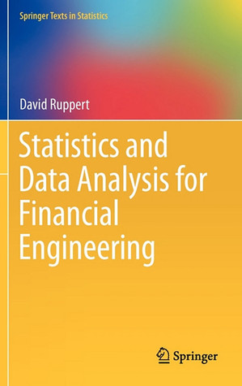

```{r setup, include=FALSE}
knitr::opts_chunk$set(echo = FALSE)
```

## Ваш преподаватель 

<div align="center">
  
</div>

+ **Салихов Марсель Робертович** -- президент [Института энергетики и финансов](https://fief.ru/), [директор](https://www.hse.ru/org/persons/26780297) Центра экономической экспертизы ИГМУ ВШЭ
+ ~15+ лет в работы в консалтинге и исследованиях. Работаю в ВШЭ с 2008 года.
+ Основные области специализации - нефтегазовые рынки, российская макроэкономика и финансовые рынки.
+ пишу на R с 2012 года, на Python - c 2017 года.

## Введение в курс 

+ Курс по выбору. Фокус -- работа с финансовыми данными/построение количественных моделей на практике.
+ Основная задача -- научиться работать с данными, расширить понимание эконометрических методов в применении к финансам.
+ Семинарские занятия -- работа с R.
+ Мы будем говорить как о теории, так и о практике. Оба аспекта важны. 
+ Отдельный фокус -- работа с российскими данными 
+ Форма контроля --  семинарские занятия -- лабораторные работы в R (50%), письменный экзамен -- тест и задачи (40%), посещаемость (10%). 

## Структура курса

1. Принципы финансов 
2. Финансовые данные и первичный (исследовательский) количественный анализ
3. Обработка и первичный анализ финансовых данных 
4. Линейные модели финансовых временных рядов (AR, MA, ARMA)
5. Модель оценки стоимости капитала (CAPM)
6. Риск и волатильность -- модели VaR и Expected Shortfall (ES), GARCH
7. Портфельная теория
8. Модели процентных ставок
9. Использование симуляционных моделей для оценки неопределенности -- методы Монте-Карло


## Основная литература

"An Introduction to Analysis of Financial Data with R" (Ruey S. Tsay)

<div align="center">
  
</div>

"Statistics and Data Analysis for Financial Engineering" (David Ruppert & David Matteson)

<div align="center">
  
</div>


## Зачем вообще изучать финансы? 

+ Работа в финансовой сфере -- банки, инвестиционные компании, фонды и проч. 
+ Личные финансовые решения -- всем придется с этим столкнуться. Необходимо понимать, как устроена финансовая система и учиться принимать рациональные финансовые решения. 
+ Финансы -- это в первую очередь, работа с данными и цифрами. Эти навыки могут пригодиться и в других сферах.

## Основные принципы финансов 

1.  Время имеет цену
2.  Риск требует компенсации (доходности)
3.  Информация -- основа принятия решений 
4.  Цены определяются рынками 
5.  Финансовая устойчивость увеличивает благосостояние


## 1. Время имеет "цену"

+ Время влияет на стоимость финансовых инструментов. Процентная ставка выплачивается, чтобы компенсировать кредитору время, в течение которого заемщик будет пользоваться его деньгами.
+ Пример заемщика  -- кредит на покупку автомобиля. Пример кредитора -- вклад в банке.  
+ Процентные ставки являются фундаментальным понятием в финансах и отражают временную стоимость денег. 


<div align="center">
  
</div>

## 2. Риск требует компенсации (доходности)

+ Мир по определению полон неопределенности. Поэтому рациональный агент принимает на себя риски только если будет вознагражден. 
+ В финансах это вознаграждение осуществляется в форме непосредственных платежей: больше риск -- больше платеж. 
+ Управление риском означает, что вы рассматриваете весь спектр возможных исходов. К примеру, вы можете отказаться от некоторых видов риска, снизить другие -- заплатив кому-либо и жить с оставшимися рисками. Пример управления риском - страховка на автомобиль.
+ Финансовая система помогает управлять рисками. 

<div align="center">
  
</div>


## 3. Информация -- основа принятия решений

+ В современном мире люди собирают *информацию* прежде, чем принимают решения. Чем более важно решение, тем больше информации мы собираем. 
+ Сбор и переработка информации для того, чтобы принять решение -- основа финансовой системы. 
+ **Пример**. Каким образом банк принимает решение о выдаче кредита? 

<div align="center">
  
</div>


## 4. Цены определяются рынками 

+ Понятие *рынка* лежит в основе современной экономической системы. 
+ Финансовая система собирает информацию от большего количества участников, агрегирует ее в ценовые стимулы, которые определяют, что ценно, а что -- нет. 
+ Финансовая система, определяя цены на стоимость кредита, стоимость акций и проч. -- выступает основой распределения капитала в современных экономиках.  
+ Развитая и эффективная финансовая система способствует экономическому росту и росту благосостояния.

<div align="center">
  
</div>

## 5. Устойчивость улучшает благосостояние 

+ Большинство из нас предпочитает стабильные доходы изменяющимся. 
+ Стабильность является предпочтительной характеристикой и для финансовой системы. 
+ Обеспечение экономической и финансовой стабильности -- одна из основных задач центральных банков. 
+ Стабильная экономика растет быстрее, чем нестабильная -- результаты исследований. 

<div align="center">
  
</div>

## Основные части финансов

1. Деньги
2. Финансовые инструменты
3. Финансовые рынки
4. Финансовые институты
5. Регулирующие органы
6. Центральный банк (денежные власти)

## Финансовые инструменты

Примеры финансовых инструментов, которые обеспечивают **сохранение стоимости во времени**: 

1. Банковский вклад
2. Облигации -- форма публичного займа.
3. Акции

Примеры инструментов, которые обеспечивают **перенос риска**: 

1. Страховка
2. Фьючерсный контракт 
3. Опцион
4. Своп 

## Финансовые рынки

+ Финансовые рынки -- это места, на которых финансовые инструменты покупаются и продаются. 
+ Финансовые рынки выполняют несколько основных **функций** : 

1. обеспечивают ликвидностью участников 
2. агрегируют и обеспечивают передачу информации 
3. обеспечивают распределение риска 

**Структура** финансовых рынков:  

+ Первичный рынок или Вторичный рынок
+ Централизованная площадка (биржа) или OTC (over-the-counter)
+ Долговой или Фондовый или Производных инструментов

## Финансовые институты
 
Специализированные финансовые институты снижают транзакционные издержки функционирования финансовой системы.  
Основные **типы** финансовых институтов: 

1. Банки -- принимают вклады и выдают кредиты
2. Страховые компании -- принимают страховые премии в обмен на принятие рисков определенных событий (страхование имущества, страхование жизни)
3. Пенсионные фонды -- обеспечивают инвестирование средств участников в ценные бумаги и другие активы. 
4. Прочие участники рынка ценных бумаг (брокеры, управляющие компании, паевые инвестиционные фонды - ПИФы, хедж-фонды, фонды private equity)
5. Государственные финансовые компании (банк развития - ВЭБ, поддержка ипотечного рынка - Агентство по ипотечному жилищному кредитованию (АИЖК), экспортное страхование - ЭСКАР, венчурное финансирование - РВК, private equity -- Роснано )

## Регулирующие органы и центральный банк

+ Государственные органы обеспечивают регулирование финансовой деятельности -- устанавливают правила и следят за их выполнением. 
+ **Банк России** обеспечивает сейчас регулирование финансовой деятельности и выполняет функции центрального банка (концепция мега-регулятора)
+ Центральный банк контролирует доступность денег и кредита с тем, чтобы обеспечить низкую инфляцию, экономический рост и стабильность финансовой системы. 
+ **Министерство финансов РФ** осуществляет регулирование отдельных сегментов (к примеру, аудиторов), обеспечивает регулирование в сфере бухгалтерского учета и отчетности (ПБУ - положения о бухгалтерском учете)
+ Концепция мега-регулятора

## Будущая стоимость (future value) 

Рассмотрим подробнее принцип "Время имеет стоимость". 

**Будущая стоимость** -- стоимость инвестиции, сделанной сегодня, на определенную будущую дату. 

$$ FV = PV + PV i = PV (1+i) $$


$$ 1000 + 1000 (0.1) = 1100 $$

$$ FV_n = PV  (1+i)^n $$

<!-- ## Пример. Будущая стоимость фиксированной суммы.  -->

<!-- Пенсионный фонд оценивает, что корпоративный спонсор (вкладчик) фонда осуществит платеж в размере 100 млн рублей через 5 лет. Фонд планирует обеспечить доходность активов в размере 9%. Управляющему фондом также необходимо оценить будущую стоимость этого вклада через 15 лет -- к моменту времени, когда начнутся выплаты. Каковая эта будущая стоимость?  -->

<!-- Оценим стоимость первоначальной инвестиции, в момент времени $t = 5$ -->

<!-- $$PV = 100\:000\:000 $$  -->
<!-- $$ r = 9% = 0.09 $$ -->
<!-- $$ n = 10  $$ -->
<!-- $$ FV_n = PV (1+r)^n = 10^8(1.09)^{10} = 10^8(2.3673764)= 236\:736\:367$$ -->

## Капитализация процентов 

**Вопрос**. Если вы положите 100 рублей на 3-летний вклад по ставке 10%, сколько вы получите денег через 3 года? 

Лет    |   Расчет        |   Стоимость
------ | --------------- | -------------
1      | $$100(1.1)$$    |    $$110$$
2      | $$100(1.1)^2$$  |    $$121$$
3      | $$100(1.1)^3$$  |    $$133,10$$

**Вопрос**. Какая будет сумма, если проценты начисляются не в конце каждого года, а ежемесячно? 


## Сложные проценты не "в годах"

Формула работает для любых периодов, просто нужно, чтобы $i$ и $n$ имели одинаковую размерность! Необходимо трансформировать годовую ставку в месячную. 

Пусть $i^m$ -- процентная ставка в месяц, а n -- количество месяцев.

тогда итоговая сумма при ежемесячном начислении будет определяется как 

$$ (100) (1 + 0.1/12)^{12} = 110,47 $$

За счет ежемесячного начисления процентов вы получаете дополнительно 0,47 рублей 

## Непрерывно начисляемые доходности  (сontinously compounded returns)


Начисление    |   Платежей  |   % за период        |  Сумма    
------------- | ----------- | -------------------- |
Ежегодно      | 1           |    0.1               | 1100.00
Полгода       | 2           |    0.05              | 1102.50
Квартал       | 4           |    0.025             | 1103.81
Месяц         | 12          |    0.0083            | 1104.71
Неделя        | 52          | $\frac{0.1}{52}$     | 1105.06
День          | 365         | $\frac{0.1}{365}$    | 1105.16
$\infty$      | $\infty$    |                      | 1105.17

## Непрерывно начисляемые доходности  (сontinously compounded returns)

$$ 1105.517 = 1000  e^{0.1} $$

Общая формула для непрерывного начисления 

$$ FV = PV e^{rn} $$
$$ PV = \frac{FV}{e^{rn}}$$

## Лог-доходность активов

Если мы поменяем в предыдущей формуле $PV$ на стоимость актива в момент времени $t$ ($P_t$) и зафиксируем единицу времени, тогда $FV = P_{t+1}$, тогда 

$$e^{r_t} = \frac{P_{t+1}}{P_t} $$

возьмем логарифм и получим сontinously compounded returns или лог-доходность актива: 

$$ r_t = ln \frac{P_t}{P_{t-1}} = log(P_t) - log(P_{t-1})  $$


Лог-доходности примерно равны "обычным" доходностям при небольших значениях ставки, так как 

$$ log(1+x) \approx x $$


## Сравнение обычной и лог-доходностей

```{r, echo=FALSE, warning=FALSE,error=FALSE,message=FALSE,fig.width=6, fig.height=6, fig.pos="right"}

retseq <- seq(-.5, .5, length=100)
 plot(retseq, log(retseq + 1), type="l",
      axes=FALSE, col="blue", lwd=3, xlab="простая доходность", ylab="Лог доходность")
 axis(1, at=c(-.5,-0.25, 0, 0.25, .5), label=c("-50%", "-25%", "0%", "25%", "50%"))
 axis(2, at=c(-.5,-0.25, 0, 0.25, .5), label=c("-50%", "-25%", "0%", "25%", "50%"))
 abline(0,1, lty=2, lwd = 2, col="red")
 
```

## Преимущества лог-доходностей

Лог-доходности **аддитивны**. Доходность за несколько периодов -- это просто суммма доходностей за каждый период. 

**Пример**. Акция Газпрома выросла в цене в 2014 году на 50%, во 2015 году упала на 50%. Какова доходность за период 2014-2015?

Какова будет доходность в лог-доходностях?

Дополнительные преимущества -- удобные статистические свойства. Поэтому в исследованиях стандартно используют расчеты в лог-доходностях. Практики  финансовых рынков используют обычные доходности, так как даже малая ошибка округления недопустима.  


## Текущая стоимость (present value)

**Текущая стоимость** - стоимость, "приведенная" по состоянию на сегодня платежа, который должен быть осуществлен в определенный момент в будущем.

$$ PV = \frac{FV}{1+i} $$
или для нескольких периодов 

$$ PV = \frac{FV_n}{(1+i)^n} $$

Текущая стоимость выше, если: 

1. Больше стоимость будущего потока платежей $FV_n$
2. Чем меньше времени до платежа $n$
3. Чем ниже процентная ставка $i$


## Понятие риска в финансах -- 1

+ Риска избежать невозможно
+ Любые экономические решения связаны с риском (К примеру, стоит ли покупать КАСКО на автомобиль или ограничиться ОСАГО? Стоит ли брать ипотеку сейчас или подождать?)
+ Понимание риска в финансах -- в отличие от других сфер жизни -- связано с необходимостью **измерения риска** и **оценки справедливой цены** за перенос риска от одного участника к другому. 

## Понятие риска в финансах -- 2 

+ **Риск** в финансах -- это **оценка меры неопределенности** относительно будущих выплат в течение определенного времени **относительно** некоторого бенчмарка. 
+ **Риск** -- величина, которая может быть оценена. 
+ **Риск** связан с неопределенностью будущего -- мы не знаем точно, какой из будущих возможных вариантов развития событий осуществится. 
+ **Риск** связан с будущими выплатами -- мы должны представить все возможные варианты и оценить их вероятности. 

## Понятие риска в финансах -- 3 

+ Понимание риска в финансах относится к инвестиции или совокупности инвестиций. Инвестиции здесь понимаются широко. 
+ Риск должен измеряться в течение определенного **временного периода**. В общем случае риск меньше в короткие промежутки времени. 
+ Риск должен измеряться относительно бенчмарка -- стандарта, а не в абсолютном выражении. К примеру, для акций обычно бенчмарк это фондовый индекс, для корпоративных облигаций -- процентная ставка по госбумагам (безрисковый актив).

## Вероятности и ожидаемая стоимость

+ Теория вероятности говорит нам, что для того, чтобы оценить неопределенность, нам необходимо составить список всех возможных исходов и оценить вероятность (шансы) каждого из этих вариантов. 
+ **Вероятность** -- это мера оценка возможности того, что событие произойдет. Вероятность находится между 0 (событие точно не произойдет) и 1 (событие точно произойдет). 

Возможность  | Вероятность | Исход
------------ | ----------- | --------
№1           |    1/2      | Орел 
№2           |    1/2      | Решка

+ Сумма вероятностей возможных исходов **должна** быть равна 1 по определению. 

## Вероятности и ожидаемая стоимость

+ Инвестируем 1000 рублей в покупку акций Газпрома. Возможные исходы: 

Возможность  | Вероятность | Исход
------------ | ----------- | --------
№1           |    0,1      | 200
№2           |    0,4      | 700
№3           |    0,4      | 1300
№4           |    0,1      | 2000

Ожидаемая стоимость (математическое ожидание) = 
$$0,1 (200) + 0,4(700) + 0,4 (1300) + 0,1 (2000) = ? $$

## Вероятности и ожидаемая стоимость

+ Ожидаемые значения удобнее считать в **доходностях (returns)**. Использование относительных мер (процентов) позволяет сравнивать доходности независимо от абсолютной суммы инвестиций. 
+ Изменчивость исходов приравнивается к риску. 
+ **Безрисковый актив** -- это инвестиция, будущая стоимость которой известна и доходность которой не связана с риском (выплаты гарантированы и не могут измениться). 


## Дисперсия и среднеквадратическое отклонение 

**Дисперсия** -- это среднее квадратов отклонений возможных исходов от ожидаемого значения, взвешенных согласно их вероятности. 

1. Рассчитать ожидаемое значение 
2. Вычесть ожидаемое значение от каждого возможного исхода и возвести в квадрат
3. Умножить каждый исход на его вероятность 
4. Сложить слагаемые

**Среднеквадратическое отклонение (СКО)** -- квадратный корень дисперсии -- имеет ту же размерность, что и исходные величины (проценты, рубли, доллары и проч.) 

Если две инвестиции имеют одинаковую доходность, но разное СКО, мы предпочитаем инвестицию с меньшим значением СКО как менее рискованную. 
