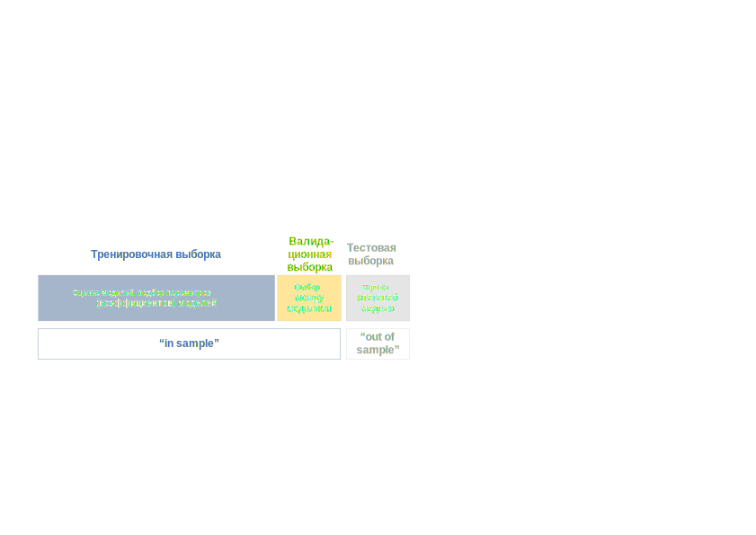

   
## Цели лекции 
   
+ разобраться в чем основные особенности финансовых серий
+ почему стационарность это важно?
+ понять, что такое автокорреляция (serial correlation)
+ понять базовые принципы построения моделей временных рядов
+ понять устройство модели случайного блуждания (random walk)
+ понять основные принципы авторегрессионных (AR) моделей
+ изучить идентификацию параметров моделей с помощью коррелограмм (ACF) 
+ научиться строить AR-модели в R


```{r setup, cache=FALSE, echo=FALSE, message=FALSE, warning=FALSE}

library("RColorBrewer")    # brewer.pal
library("knitr")           # opts_chunk
#library(rusquant)
library(forecast)
library(quantmod)


# color palette
palette(brewer.pal(6, "Set1"))

opts_chunk$set(fig.width=12, fig.height=7, fig.align="center", echo=FALSE, tidy=FALSE)
opts_chunk$set(cache=TRUE, fig.align="center", comment=NA, echo=FALSE, tidy=FALSE)

# преобразовать объект xts в dataframe с сохранением индекса даты
XtstoDf <- function(ts, ...){ 
  df <- as.data.frame(ts)
  df$date <- time(ts)
  return(df)
}
# encapsulate the plotting commands into a function so that we don't have to repeat ourselves
fancy.plot <- function(x, y, hguide=0, vguide=0, type = "p", col = "black", pch = 1, cex = 1, ...) {
    # set up plot region
    plot(x, y, type="n", axes=FALSE, ...)
    
    # add axes
    Axis(x, side=1, lwd=0, lwd.ticks=1, labels=TRUE)
    Axis(y, side=2, lwd=0, lwd.ticks=1, labels=TRUE)
    Axis(x, side=3, lwd=0, lwd.ticks=1, labels=FALSE)
    Axis(y, side=4, lwd=0, lwd.ticks=1, labels=FALSE)
    
    # add horizontal guide lines
    usr <- par("usr")
    if (hguide > 0) {
        abline(h=seq(usr[3], usr[4], length.out=hguide+2)[-c(1,hguide+2)], col="gray")
    }
    if (vguide > 0) {
        abline(v=seq(usr[1], usr[2], length.out=vguide+2)[-c(1,vguide+2)], col="gray")
    }

    # add the data
    if (type == "l") {
        lines(x, y, col=col)
    } else if (type == "p") {
        points(x, y, cex=cex, pch=pch, col=col)
    }
    
    # add frame
    box()
}

#load('../.RData')
```


## Пример финансовой серии -- индекс S&P 500

```{r, cache=TRUE, echo=FALSE, message=FALSE, warning=FALSE}
getSymbols("^GSPC",src="yahoo") # get yahoo finance 
chart_Series(GSPC)

```
построим график логарифма серии и разницы в логарифмах (лог-доходность)

```{r, cache=TRUE, echo=FALSE, message=FALSE, warning=FALSE}
chart_Series(log(GSPC))
chart_Series(diff(log(Cl(GSPC))))

```


## Основные особенности финансовых серий: 

1. Многие финансовые серии растут **экспоненциально** и имеют изменяющуюся волатильность в зависимости от уровня значений.
2. Наблюдения, которые находятся рядом, скоррелированны между собой. 
3. Доходности имеют избыточный эксцесс (**heavy tails**) и **не распределены** нормально.
4. Волатильность устойчива во времени (persistent) и часто в финансовых данных наблюдаются **кластеры волатильности** - периоды большой и низкий волатильности сохраняются определенное время.

## Что такое модель?

+ Когда мы работаем с финансовыми данными, обычно мы хотим научиться либо прогнозировать, либо симулировать их (к примеру, для риск-менеджмента). Для того, чтобы строить прогнозы или симуляции, необходимо иметь **модель** серии. 
+ Модель -- это упрощенное представление о реальности. Мы хотим, чтобы модели наши модели инкорпорировали особенности серий, которые наблюдаются эмпирически.  

## Автокорреляция 

+ Часто в финансовых сериях последовательные точки наблюдений влияют друг на друга в определенной степени -- имеют корреляцию. С точки зрения количественного анализа задача состоит в том, чтобы идентифицировать и структурировать эти корреляции. 
+ Содержательно эту зависимость можно представить как распространение информации. Инвесторам требует какое-то времени, чтобы оценить и интерпретировать поступающую информацию. По этим причинам доходности в момент времени $t$ могут быть связаны с доходностью в момент времени $t-1$. Таким образом, в серии сохраняется определенная "память".
+ Адекватное моделирование этой корреляции может существенно улучшить возможности прогнозирования и для более сложных моделей. 
+ Если последовательные наблюдения во временном ряде скоррелированы между собой, то мы говорим, что в ряде есть **серийная корреляция** (или **автокорреляция**)

## Автокорреляция - определение

Автокорреляция с лагом $k$ или $\rho_k$ определяется **автоковариацией**, нормализованной на дисперсию ряда: 

$$\rho_k = \frac{C_k}{\sigma^2} $$
**Автоковариация** временного ряда с лагом $k$ определяется как 

$$C_k = E[(x_t - \mu)(x_{t+k}-\mu)] $$
где $\mu$ -- это ожидаемое значение (среднее) временного ряда. Ковариация определяет степень **линейной зависимости** между переменными, то есть ковариация говорит, на сколько переменные изменяются вместе. Корреляция может не учесть нелинейную зависимость, которая есть в серии. 

На практике мы не знаем истинных значений этих параметров (среднего, дисперсии, ковариации) и вынуждены оценивать **выборочные** значения --  по имеющейся выборке. 

## Коррелограмма

+ **Коррелограмма** -- это график, на котором отражены значения выборочной автокорреляции с последовательными лагами. Этот график позволяет  удобно увидеть структуру автокорреляции на каждом лаге. 
+ Основное использование коррелограммы -- визуально находить автокорреляцию. Потом мы будем "убирать" ее  с помощью оцененной (fitted) модели. 
+ Коррелограмма остатков модели позволяется оценивать "остаточную" автокорреляцию и понять, необходимы ли дальнейшие доработки модели. 
+ В R коррелограмма строится с помощью функции `acf` (или `forecast::Acf`). В большинстве статистических программ также реализован этот функционал. 


## Коррелограмма последовательно нормально распределенных случайных величин 

```{r, echo=TRUE}
set.seed(123)
w <- rnorm(100) ## 100 нормально распределенных величин со средним = 1 и дисперсией = 1
acf(w)
```

+ На лаге 0 коррелограмма всегда имеет значение 1 (корреляция наблюдений с самими собой)
+ Прерывистые синие линии означают **границы** на которых мы имеем свидетельства против нулевой гипотезы, что корреляция на этом лаге равна нулю (на 5% уровне).То есть граница позволяет нам оценивать "статистически значимое" отличие корреляции от 0. 
На практике мы смотрим на те лаги, которые пересекают прерывистые линии (однако надо иметь в виду, что 5% этих лагов должны пересекать границы в любом случае!)
+ Коррелограмма также позволяет оценивать сезонные эффекты (к примеру, автокорреляция с лагом 12 для месячных данных)

## Коррелограмма для линейного тренда

```{r, echo=TRUE}
w <- seq(1, 100)
layout(1:2) # расположить графики друг на другом 
plot(w, type="l")
acf(w)
```

+ АСF снижается линейным образом по мере увеличения лагов
+ Коррелограмма такого вида указывает на наличие линейного тренда в серии

## Коррелограмма для повторяющейся последовательности


```{r, echo=TRUE}
w <- rep(1:10, 10)
layout(1:2)
plot(w, type="l")
acf(w)
```

+ ACF имеет пики на значениях 10 и 20 (наш исходный ряд имеет  цикл = 10)
+ На значениях лагов 5 и 15 отрицательная корреляция равная -0,5
+ Коррелограмма подобного вида указывает на наличие сезонной (периодической) компоненты в серии 


## PACF -- частичная корелограмма 

+ PACF -- частичная (частная) автокорреляция (partial autocorrelation)
+ ACF характеризует последовательную зависимость случайной своей величины от своих лагированных значений. 
+ Частичная автокорреляция похожа на обычную автокорреляцию, однако дополнительно удаляет линейную зависимость на лагах, предшествующих рассматриваемому.  
+ Частичная автокорреляция на лаге $t$ это коэффициент линейной регрессии при $x_t$, а регрессии включены все предыдущие лаги - $x_1, x_2, ..., x_{t-1}$. 


PACF для линейного тренда. 

```{r, echo=TRUE}
w <- seq(1, 100)
layout(1:2) # расположить графики друг на другом 
plot(w, type="l")
pacf(w)
```


```{r, echo=TRUE}
w <- seq(1, 100)
layout(1:2) # расположить графики друг на другом 
plot(w, type="l")
acf(w)
```


## ACF/PACF для доходностей индекса S&P 500

```{r, cache=TRUE}
rets <- diff(log(Cl(GSPC)))
rets <- rets[!is.na(rets)]
acf(rets)
pacf(rets)
```


## Понятие стационарности и почему оно важно

+ Стандартным допущением при анализе временных рядов является **стационарность**. Методы временных рядов как правило нельзя использовать, если это условие не соблюдается!
+ Серия является стационарной, если параметры генерирующего процесса (обычно это среднее и дисперсия) не меняются со временем и отсутствует автокорреляция. 
+ Рассмотрим две серии А и B. Параметры серии А (среднее арифметическое, стандартное отклонение) - не меняются со временем

```{r, echo=TRUE}
mu = 0
sigma = 1
T = 100
A <- rnorm(T, mu, sigma)
plot(A, type = 'l')
```

## Понятие стационарности и почему оно важно (2)

Для серии B среднее (mean) меняется со временем 

```{r, echo=TRUE}
mu = 0
sigma = 1
T = 100
B <- rep(0, 100)
t <- seq(0,T, by = 1)

for(i in 1:T){
   B[i] <- rnorm(1, 0.05*i, sigma)
}

plot(B, type = 'l')

```

## Почему не-стационарнасть опасна?

+ Многие статистические цены требуют, чтобы данные, которые тестируются, были стационарны. 

К примеру, возьмем среднее для не-стационарного ряда (серия B, сгенерированная ранее): 

```{r}
plot(B, type = 'l')
abline(h = mean(B), col = 'red')
```

+ Рассчитанное среднее значение для всех точек бессмысленно с точки зрения прогнозирования будущих значений. 
+ Устойчивость параметров во времени дает основания считать, что рассчитанные по прошлым данным параметры, будут иметь значение и в будущем. 


## Как можно проверить стационарность серии?

1. Глазами -- всегда полезно смотреть график данных. 
2. Оценивать среднее и дисперсию скользящим окном
3. Формальные тесты на стационарность 


Проверим стационарность с помощью стандартного теста Augmented Dickey-Fuller. 

```{r, echo=TRUE}
library(tseries)
adf.test(A)
adf.test(B)
```


Если серия нестационарна $x_t$, можно посчитать ее разность ( $z_t = x_t - x_{t-1}$) и проверить ее на стационарность.  


## Белый шум 

+ Базовый подход к построению модели временного ряда -- это получение в результате оценки модели **остатков**, в которых отсутствует автокорреляция. 
+ Если $y_t$ -- наблюдаемое значение в момент времени $t$, а $\hat{y_t}$ -- предсказанное моделью значение, то остаток (residual)

$$x_t = y_t - \hat{y_t}  $$

Рассмотрим временной ряд вида ${w_t: t=1,\ldots,n}$. Если элементы ряда $w_t$ являются независимыми одинаково распределенными (i.i.d.) величинами: 

1. со средним (mean) равным 0 
2. дисперсией (variation), равной $\sigma^2 = const$
3.отсутствием автокорреляции ($Cor(w_i, w_j) \neq 0, \forall i \neq j$)

Тогда серия $w_t$ представляет собой **белый шум** (**white noise**). 

Пример гауссовского белого шума: 

```{r, fig.width=12, fig.height=12}
set.seed(123)
layout(1:2)
w = rnorm(1000)
plot(w, type="l")
acf(w)

```


Белый шум невозможно прогнозировать. Поэтому если остатки в модели -- белый шум, вы добились успеха. 

$$x_t = signal + noise $$
Белый шум всегда стационарен! Но не каждый стационарный ряд является белым шумом.  


## Модель случайного блуждания (random walk)

+ Модель `random walk` -- это модель временного ряда, в которой текущее значение равно предыдущему значению плюс случайная компонента (*белый шум*). 

$$ x_t = x_{t-1} + w_t $$

+ Случайное блуждание -- это просто сумма отдельных белых шумов. 

$$ x_t = x_{t-2} + w_{t-2} + w_t = x_0 + \sum_{i=0}^{t-1}{w_{t-i}}$$
$$E(x_t) = x_0 + E(\sum_{i=0}^{t-1}{w_{t-i})})= x_0 $$
$$Var(x_t) = \sum_{i=0}^{t-1}Var(w_{t-1} = t \sigma^2=f(t)) $$
Поэтому random walk не является стационарным!

```{r, echo=TRUE}
set.seed(123)
x <- w <- rnorm(1000)
for (t in 2:1000) x[t] <- x[t-1] + w[t]
layout(1:2)
plot(x, type="l")
acf(x)

```

## Модель random walk для финансовых данных 

```{r, echo=TRUE, warning=FALSE}
getSymbols('^GSPC', src='yahoo')
acf(diff((Cl(GSPC))), na.action = na.omit, main = 'Автокорреляция лог-доходностей индекса S&P 500')
```

+ Можем ли  мы заключить, что модель случайного блуждания адекватно оценивает доходности индекса S&P 500?

## АR (авторегрессионная) модель

+ Авторегрессионная модель, или $AR(p)$ модель, создается путем регрессирования временного ряда на собственные предыдущие значения (лаги). 
+ Простейшей формой является AR(1), в которой используется только один предыдущий лаг. 
+ AR(1) модель для серии $x_t$ имеет следующий вид: 

$$x_t = b_0 + b_1 x_{t - 1} + \epsilon_t$$

+ Модель AR(p) имеет следующий вид: 

$$x_t = b_0 + b_1 x_{t-1} + b_2 x_{t - 2} \ldots + b_p x_{t - p} + \epsilon_t$$

## Допущения для моделей AR

Для правильного функционирования AR-моделей исходные временные ряды должны быть **стационарными**.  На практике это означает выполнение трех условий: 

1. Ожидаемое значение временного ряда является постоянным и конечным, то есть $E[y_t] = \mu$ и $\mu < \infty$ для всех значений  $t$
2. Дисперсия временного ряда является постоянной и конечной для всех периодов 
3. Ковариация временного ряда с самим собой для любого фиксированного количества периодов является постоянной и конечной.

$$cov(y_t, y_{t - s}) = \lambda,  |\lambda| < \infty,  \lambda =  {constant}, \\  t = 1, 2, \ldots, T; s = 0, \pm 1, \pm 2, \ldots, \pm T $$

+ Если эти условия не выполняются, тогда результаты оценки модели не будут иметь практического смысла (оценки параметров будут смещенными, и любые тесты для модели не будут достоверными!)

## Обоснование AR-модели 

Вспомним, что модель случайного блуждания (random walk) имеет следующий вид: 

$$x_t  = x_{t-1} + w_t $$ 
то есть, каждый элемент $x_t$ зависит только от своего предыдущего значения $x_{t-1}$ и случайной компоненты белого шума (white noise)

+ Авторегрессионная модель -- это просто расширение модели случайного блуждания, которая включает несколько лаговых компонент и коэффициент при предыдущем лаге не обязательной равен 1. 
+ Модель является **линейной**, так как объясняемое значение линейным образом зависит от своих предыдущих значений
+ Модель AR -- это регрессионная модель, в которой прошлые значения используют как предикторы.  
+  AR-компонента в финансовых данных указывает нам на то, что серия имеет трендовое (trending) или возвращающееся к среднему (mean reversion) поведение. 


## Симуляция AR(1)

Сгенерируем самостоятельно AR-процесс со значением $b_1$ = 0.7

```{r, echo=TRUE}
set.seed(123)
ar1 <- w <- rnorm(100) # создадим белый шум
for (t in 2:100) ar1[t] <- 0.7*ar1[t-1] + w[t]

```


```{r}
layout(1:2)
plot(ar1, type="l")
acf(ar1)
pacf(ar1)
```

+ попробуем оценить модель, с тем чтобы "восстановить" исходные параметры
+ В R для оценки AR-моделей можно использовать функцию `ar`. 

```{r, echo=TRUE}
ar1_est <- ar(ar1, method = "mle", se.fit=TRUE)
ar1_est$order
ar1_est$ar
ar1_est$ar + c(-1.96, 1.96)*sqrt(ar1_est$asy.var) ## доверительный интервал для параметра

```

## Симуляция AR(1) c отрицательным параметром

попробуем параметр  $b_1$ = -0.6

```{r, echo=TRUE }
set.seed(123)
ar1 <- w <- rnorm(100) # создадим белый шум
for (t in 2:100) ar1[t] <- -0.6*ar1[t-1] + w[t]
plot(ar1, type="l")
acf(ar1)
pacf(ar1)
```


## АR(2) 

Рассмотрим теперь AR(2) модель, в которой используется два лага для моделирования текущего значения: 

```{r, echo= TRUE}
set.seed(123)
ar3 <- ar2 <- w <- rnorm(1000)
for (t in 3:1000) ar2[t] <- 0.66*ar3[t-1] - 0.333*ar3[t-2]  + w[t]
layout(1:3)
plot(ar2, type="l")
acf(ar2)
pacf(ar2)
```

попробуем оценить параметры c помощью функции `ar`

```{r, warning=FALSE, message=FALSE, echo=TRUE}
ar2_est <- ar(ar2, method = "mle")
ar2_est
```


## АСF для AR(1) и AR(2)

```{r}
par(mfrow=c(1,2))
acf(ar1); acf(ar2)

```

## PАСF для AR(1) и AR(2)

```{r}
par(mfrow=c(1,2))
Pacf(ar1)
Pacf(ar2)
```

## Оценка - использование AR-модели для цен на нефть 

Пример -- цены на нефть

```{r, warning=FALSE, message=FALSE, echo=TRUE}
library(quantmod)
getSymbols("DCOILWTICO", src = "FRED")
wti <- DCOILWTICO['2000::'] ## ограничим используемую выборку 
plot.xts(wti)

```

## Использование AR-модели для цен на нефть  (2)

посчитаем лог-доходности, чтобы перейти от нестационарной серии к стационарной (потенциально). 

```{r, warning=FALSE, message=FALSE, echo=TRUE}
wti.rtn = diff(log(wti))
wti.rtn <- wti.rtn[complete.cases(wti.rtn),]
plot(wti.rtn)
```

```{r}
acf(wti.rtn, na.action=na.omit)
```


```{r, warning=FALSE, message=FALSE, echo=TRUE}
wti_ar <- ar(wti.rtn, na.action=na.omit)
wti_ar$order

```

Модель имеет 23 лага! Ограничим модель 2 лагами максимально. 

```{r, warning=FALSE, message=FALSE, echo=TRUE}
wti_ar <- ar(wti.rtn, na.action=na.omit, order.max = 2)
wti_ar$order
ar2_est$ar

```

посмотрим на остатки модели 

## Остатки для AR(2)-модель цен на нефть

```{r, warning=FALSE, message=FALSE, echo=TRUE}
resid <- residuals(wti_ar)
plot(resid, type="l", col=2)
Acf(resid)
```

Судя по АСF остатков, AR(2) не очень хорошо подходит для моделирования динамики цен на нефть! 


## Остатки модели 

+ Остатки модели - остатки между расчетными величинами и фактическими значениями. 
+ Исследование остатков -- важный шаг для оценки качества моделей. 
+ Хорошая модель "оставляет" после себя остатки, которые не имеют структуры.  


## PACF для AR-моделей


пример AR(1) модели 

```{r}
library(forecast)
set.seed(123)
ar1 <- w <- rnorm(500) # создадим белый шум
for (t in 2:500) ar1[t] <- 1.001*ar1[t-1] + w[t]
plot(ar1, type="l")
layout(1:2)
Acf(ar1)
Pacf(ar1)

```

пример AR(2) модели 

```{r, echo= TRUE}
set.seed(123)
ar2 <- w <- rnorm(1000)
for (t in 3:1000) ar2[t] <- 1.5*ar2[t-1] - 0.5*ar2[t-2]  + w[t]
plot(ar2, type="l")
layout(1:2)
Acf(ar2)
Pacf(ar2)
```


Мы используем PACF для того, чтобы оценить возможный порядок AR-модели!


## Тест Льюнга-Бокса (Ljung Box test)

Тест Льюнга-Бокса был предложен в 1978 году и основан на статистике $Q^*$

$$ Q^* = T(T+2)\sum_{k=}^h (T-k)^{-1}r_k^2 $$

$T$ -- длина серии 
$r_k$ -- величина автокорреляции на лаге $k$
$h$ -- количество тестируемых лагов (его необходимо задавать при использовании теста)

Большие значения $Q^*$ указывают на наличие автокорреляции в серии. Значение теста сравнивается с критическими значениями распределения хи-квадртат с $h-K$ степенями свободы ($K$ - количество оцениваемых параметров).

При значении p-value меньше 0,05, принимается гипотеза о наличии автокорреляции в серии. 


## Как можно посчитать ошибку? 

Ошибка (остаток) представляет собой разницу между фактическим и предсказанными значением. То есть "ошибка" обозначает не ошибку, а часть серии, которая не была объяснена моделью. 

$$e_{t} = y_{t} - \hat{y}_{t} $$

Ошибки можно посчитать для тренировочной выборки и для тестовой выборки. 

Существует несколько разных вариантов, как можно сравнить фактические и модельные значения ряда. 


$$ {\text{Mean absolute error}: MAE}  = {mean}(|e_{t}|)$$

$$\text{Root mean squared error: RMSE}  = \sqrt{\text{mean}(e_{t}^2)} $$

Процентная ошибка определяются как $ p_t = 100 \epsilon_t/y_t $

$$\text{Mean absolute percentage error: MAPE} = \text{mean}(|p_{t}|) $$


## Тестовая/тренировочная выборка

**Тренировочная выборка** (`training set`) -- часть данных, которая используется для построения модели. 

**Тестовая выборка** (`test set`) -- часть данных, которая используется для оценки качества и выбора альтернативных моделей.

<div align="center">
  
</div>

## Валидационная выборка 


Иногда используется подход с разделением общей выборки на три части - тренировочная, валидационная, тестовая. 

**Валидационаня выборка** (`validation set`) -- часть данных, которая используется для оптимизации параметров и выбора между альтернативными моделями. Тестовая выборка тогда служит для итоговой оценки качества итоговой модели, выбранной из нескольких альтернативных. 


<div align="center">
  
</div>


## Выводы 

1. Большинство финансовых серий имеют автокорреляцию. 
2. Учет автокорреляции важен для построения моделей и оценки статистических эффектов. 
3. Для оценки порядка модели AR можно использовать график PACF. Теоретически порядок модели $AR(p)$ имеет последний значимый лаг на уровне $p$.
4. Мы предпочитаем использовать более простые модели, которые имеют меньше параметров для того, чтобы избежать "подгонки" под данные (overfitting).  


## Использованные источники: 

1. "An Introduction to Analysis of Financial Data with R" (Ruey S. Tsay)
2. "Statistics and Data Analysis for Financial Engineering" (David Ruppert & David Matteson)
3. Analyzing Financial Data and Implementing Financial Models Using R (Clifford Ang)
4. Forecasting Financial Time Series (Patrick Perry)
5. Autoregressive Moving Average ARMA(p, q) Models for Time Series Analysis (Michael Halls-Moore)

