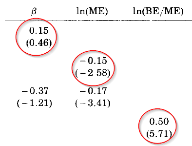

## Цели лекции 

+ понять теоретические основы CAPM
+ применение CAPM для оценки эффективности портфельных инвестиций 
+ применение CAPM для оценки "справедливой" стоимости собственного капитала
+ оценку показателей CAPM в R
+ проблемы с эмпирическим обоснованием CAPM
+ изучить, как устроена 3-факторная модель Фамы и Френча (Fama & French 1992).

```{r setup, cache=FALSE, echo=FALSE, message=FALSE, warning=FALSE}

library("RColorBrewer")    # brewer.pal
library("knitr")           # opts_chunk
library(forecast)


# color palette
palette(brewer.pal(6, "Set1"))

opts_chunk$set(fig.width=12, fig.height=7)
opts_chunk$set(cache=TRUE, fig.align="center", comment=NA, echo=TRUE, tidy=FALSE)

# преобразовать объект xts в dataframe с сохранением индекса даты
XtstoDf <- function(ts, ...){ 
  df <- as.data.frame(ts)
  df$date <- time(ts)
  return(df)
}
load('../.RData')
```


## CAPM
   
+ Модель CAPM (Capital Asset Pricing Model) -- одна из наиболее известных и используемых моделей в финансах. 
+ CAPM дала теоретические основания для распространения пассивного инвестирования.
+ CAPM дает возможность оценивать ожидаемые доходности для различных инвестиций и помогает оценивать "справедливые" значения доходностей для компаний, которые не торгуются публично. 
+ CAPM используется для установления "справедливых" норм прибыли для оценки отдачи вложенного капитала в регулируемых видах деятельности. 
+ Модель CAPM широко используется на практике, но есть серьезные проблемы с ее эмпирической поддержкой. 


## СAPM -- возникновение

+ В 1990 году Уильям Шарм получил Нобелевскую премию по экономике за работу по CAPM, опубликованную в 1964 году **(Sharpe, William F. "Capital asset prices: A theory of market equilibrium under conditions of risk." The journal of Finance 19.3 (1964): 425-442.)**
+ Другие авторы, примерно в это же время работавшие над этой темой независимо от Шарпа, получившие аналогичные результаты -- Джон Линтнер, Джек Трейнор и Ян Моссин. 
+ Примечательно то, что статья Шарпа была отвергнута журналом Journal of Finance и была принята к публикации только через два года, когда сменился редактор журнала. 

<div align="center">
  
</div>


## Основополагающая идея CAPM

+ Основная революционная идея CAPM заключалась в том, что премия за риск отдельной ценной бумаги не связана с ее "индивидуальным риском". 

**Риск-премия бумаги обусловлена вкладом данной ценной бумаги в общий риск эффективно диверсифицированного портфеля**.

Это базовая идея CAPM!

+ Рыночной портфель -- и есть оптимальный портфель по Марковицу (mean-variance).

## Допущения 

CAPM строится с представления о том, какие бы были премии за риск для акций, если выполняются следующие допущения: 
   
1. **Цены находятся в равновесии**. Для каждой бумаги спрос равен предложению.
2. **Все участники рынка имеют одинаковые прогнозы** для ожидаемых значений доходности и риска. Следовательно, они вкладывают свои средства в рискованные активы таким образом, что в итоге сосредотачивают их в своих портфелях в одних и тех же пропорциях. 
3. **Все участники выбирают оптимальные портфели** по Марковицу, исходя принципов эффективной диверсификации. Это означает, что все инвесторы имеют тангенциальный портфель рисковых активов, а также безрисковый актив. 
4. Рынок дает получить дополнительную доходность за риск, который нельзя избежать, но на рынке нет вознаграждения за риск, который связан с неэффективным выбором портфеля. Риск премии для отдельной бумаги связано с не с риском самой бумаги непосредственно, а ее вкладом в риск эффективного портфеля. 

Исходя из допущения №3, следует, что рыночной портфель является аппроксимацией тангенциального портфеля. 

## Рыночный портфель (market portfolio)

+ Исходя из приведенных предпосылок и с учетом того, что относительное количество рискованных активов у каждого инвестора оказывается одинаковым, фондовый рынок может находиться в равновесии в случае, если эти оптимальные пропорции соответствуют пропорциям, в которых активы представлены на рынке. 
+ Портфель, состоящий из всех имеющихся ценных бумаг, пропорции инвестирования в которые соответствуют их доли в общей рыночной капитализации, называется **рыночным портфелем**.
+ Состав рыночного портфеля отражает предложение существующих финансовых активов, оцененных по текущим рыночным ценам. 
+ На практике за рыночной портфель принимают широко диверсифицированный индекс (S&P 500, к примеру). 
+ Существуют разные представления о том, что же все таки стоит включать в рыночный портфель -- акции компаний иностранных рынков? недвижимость? производные инструменты? По факту мы не можем точно измерить рыночной портфель. 

**Важно: CAPM соблюдается, если верны допущения** 

## Capital Market Line (CML)

**capital market line** связывает дополнительную ожидаемую доходность эффективного портфеля и его риск. 

**Ожидаемая избыточная доходность** -- это ожидаемая доходность минус безрисковая ставка, она также называется **риск-премия**. 

$$r_P = r_f + \frac{r_M - r_f}{\sigma_M}\sigma_P $$
   
где $r_P$ -- это доходность данного эффективного портфеля (сочетание рыночного портфеля и безрискового актива), 

$r_f$ -- безрисковая ставка;

$r_M$  -- ожидаемая доходность рыночного портфеля 

$\sigma_M$ -- стандартное отклонение $R_M$

$r_M - r_f$ -- премия за риск рыночного портфеля

$r_P - r_f$ -- премия за риск нашего эффективного портфеля 


$r_f, r_M, \sigma_M$ -- константы, что меняется в этом уравнении это -- $r_P, \sigma_P$, то есть соотношение рыночного портфеля и рискового актива в портфеле. 


```{r, echo=FALSE}
mu1 = 0.14
mu2 = 0.08
sig1 = 0.2
sig2 = 0.15
rho = 0
rf = 0.06
w = seq(0, 1, len = 500)
means = mu2 + rf * w
var = sig1^2 * w^2 + sig2^2 * (1 - w)^2
risk = sqrt(var)

ind = !(risk > min(risk))
ind2 = (means > means[ind])
wt = 0.693
meant = 0.08 + 0.06 * wt
riskt = sqrt(sig1^2 * wt^2 + sig2^2 * (1 - wt)^2)

wp = 0.475
meanp = 0.08 + 0.06 * wp
riskp = sqrt(sig1^2 * wp^2 + sig2^2 * (1 - wp)^2)


plot(risk, means, type = "l", lwd = 1, xlim = c(0, 0.21), ylim = c(0.0575, 0.145), xlab = 'Стандартное отклонение портфеля', ylab = 'ожидаемая доходность')
abline(v = 0)
lines(risk[ind2], means[ind2], type = "l", lwd = 5, col = "red")
lines( c(0, riskt), c(rf, meant), col = "blue", lwd =2)

text(riskt, meant, "T", cex = 1.2)
text(sig1, mu1, "R1", cex = 1.2)
text(sig2, mu2, "R2", cex = 1.2)
text(0, rf, "F", cex = 1.2)

text(min(risk), means[ind], "MV", cex = 1.2)

```


## Угол наклона CML

Угол наклона CML равен:
   
   $$ \frac{r_M - r_f}{\sigma_M}$$
   
Угол наклона можно интерпретировать как отношение премии за риск к стандартному отклонению рыночного портфеля -- уже известный нам **показатель Шарпа (Sharpe Ratio)**.

**Следствие -- все эффективные портфели имеют тот же показатель Шарпа, что и рыночной портфель**

## Пример CML

Рассмотрим линию рынка капитала (CML), если $r_f = 0,06; r_M= 0,15; \sigma_M = 0,22$.

<div align="center">
  
</div>

+ Все эффективные портфели лежат на линии, которая соединяет безрисковый актив (F) и рыночный портфель (M) -- это следует из оптимизации по Марковицу. 
+ Добавление CAPM -- рыночный портфель является эффективным. Нам нет необходимости искать веса в оптимальном портфеле, можно просто использовать долю рыночной капитализации компании в общем индексе. 

## Следствия из СAPM

1. Для большинства инвесторов результаты пассивной стратегии (комбинирование безрисковых активов с вложениями в пассивные инвестиционные фонды, реплицирующих широкий индекс) -- так же хороши, как если бы вели активный поиск доходных ценных бумаг. 
2. Премия за риск для каждой отдельной бумаги пропорциональна только ее вкладу в совокупный риск всего рыночного портфеля. Премия за риск не зависит от риска, присущего ей в отдельности. 

```{r, echo=FALSE, message=FALSE, warning=FALSE, eval=FALSE}
library(Ecdat)
library(quadprog)
data(CRSPday)

R = 100*CRSPday[,4:6]  #  convert to percentages
mean_vect = apply(R,2,mean)
cov_mat = cov(R)
sd_vect = sqrt(diag(cov_mat))
Amat = cbind(rep(1,3),mean_vect)  # set the constraints matrix
muP = seq(.05,.14,length=300)  # set of 300 possible target values
# for the expect portfolio return
sdP = muP # set up storage for std dev's of portfolio returns
weights = matrix(0,nrow=300,ncol=3) # storage for portfolio weights
for (i in 1:length(muP))  # find the optimal portfolios for each target expected return
{
   bvec = c(1,muP[i])  # constraint vector
   result =
      solve.QP(Dmat=2*cov_mat,dvec=rep(0,3),Amat=Amat,bvec=bvec,meq=2)
   sdP[i] = sqrt(result$value)
   weights[i,] = result$solution
}
plot(sdP,muP,type="l",xlim=c(1.0,1.325),ylim=c(0.076,.12),lty=3, lwd = .5)  #  plot
mufree = 1.3/253 # input value of risk-free interest rate
points(0,mufree,cex=4,pch="*")  # show risk-free asset
sharpe =( muP-mufree)/sdP # compute Sharpe's ratios
ind = (sharpe == max(sharpe)) # Find maximum Sharpe's ratio
options(digits=3)
weights[ind,] #  print the weights of the tangency portfolio
lines(c(0,2),mufree+c(0,2)*(muP[ind]-mufree)/sdP[ind],lwd=4,lty=1, col = "blue")
# show line of optimal portfolios
points(sdP[ind],muP[ind],cex=4,pch="*") # show tangency portfolio
ind2 = (sdP == min(sdP)) # find the minimum variance portfolio
ind3 = (muP > muP[ind2])
lines(sdP[ind3],muP[ind3],type="l",xlim=c(0,.25),
      ylim=c(0,.3),lwd=3, col = "red")  #  plot the efficient frontier
text(sd_vect[1],mean_vect[1],"GE",cex=1.15)
text(sd_vect[2],mean_vect[2],"IBM",cex=1.15)
text(sd_vect[3],mean_vect[3],"XOM",cex=1.15)
w = seq(0, 1.5,len = 500)
covjm = cov(R[,3], R %*% weights[ind])
mup2 = w * weights[ind] %*% mean_vect + (1 - w) * mean_vect[3]
sdp2 = sqrt(w^2 * sdP[ind]^2 + (1 - w)^2 * sd_vect[3]^2 + 2 * w * (1 - w) * covjm)
lines(sdp2, mup2, lwd = 3, col = "purple")
legend("topleft", c("CML", "эффективный портфель","тангенциальный портфель и  XOM","тангенциальный портфель"),
       col = c("blue","red","purple","black"),
       lty = c(1,1,1,NA), lwd = c(4,3,3,NA), pch = c(NA,NA,NA,"*"), pt.cex = c(1,1,1,4)  )


```


## Security Market Line 

+ **Security market line (SML)** связывает избыточную доходность актива с его его углом наклона к рыночному портфелю.
+ SML отличается от CML в том смысле, что SML применима для любого актива, в то время как CML применима только к эффективным портфелям. 

Это выражение описывает линию доходности рынка ценных бумаг (SML): 
$$E(r_i) - r_f = \beta_i[E(r_M) - r_f] $$

+ SML говорит, что риск-премия актива $i$ является произведением его беты ($\beta$) на риск-премию рыночного портфеля. 
+ Уравнение SML и есть базовое уравнение модели CAPM.

## Бета ($\beta$)

+ Риск эффективного портфеля определяется величиной $\sigma_M$.
+ Общая мера присущего ценной бумаги риска (систематического риска) в рамках CAPM задается коэффициентом "бета".
+ $\beta$ отражает предельный вклад доходности данной ценной бумаги в дисперсию доходности рыночного портфеля. 

$$\beta_i = \frac{\sigma_{iM}}{\sigma_M^2} $$
где $\sigma_{iM}$ -- ковариация доходностей между i-ой ценной бумаги и доходностью рыночного портфеля.


Можно выразить дисперсию рыночного портфеля как:

$$\sigma_M^2 = \sum w_i Cov(r_i, r_m) $$

где $w_i$ -- доля i-ого актива в рыночном портфеле. 

## Интепретация беты

Значения беты дают возможность интерпретировать риск актива (портфеля):

$\beta > 1$ -- агрессивный актив (портфель); 

$\beta = 1$ -- средний уровень риска; 

$\beta < 1$ -- консервативный портфель 


<div align="center">
  
</div>


В данном случае акция J находится ниже границы SML. СAPM прогнозирует, что цена бумаги J будет снижаться пока она вновь не окажется на линии SML. 

## Отраслевые беты для американских компаний 

<div align="center">
  
</div>

Источник: [Betas by Sector (US), by Aswath Damodaran](http://pages.stern.nyu.edu/~adamodar/New_Home_Page/datafile/Betas.html)


## Расчет беты в R

Коэффициент бета можно рассчитать с помощью обычной линейной регрессии в R:

```{r}
# OnDate <- start.date <- as.Date('2010-01-01')
# ToDate <- end.date <- Sys.Date()
# ROSN <- QuantTools::get_finam_data('ROSN', from = start.date, to = end.date) # индекс ММВБ
# ROSN <- quant_tools_to_xts(ROSN)
# MICEX <- QuantTools::get_finam_data('MICEX', from = start.date, to = end.date) # индекс ММВБ
# MICEX <- quant_tools_to_xts(MICEX)
# ROSN.rtn <- diff(log(ROSN$close))
# MICEX.rtn <- diff(log(MICEX$close))
# #
# # # получить безрисковкую ставку (1-летние ОФЗ)
# source('https://raw.githubusercontent.com/quantviews/CBR/master/codes_new/CBR_web.R')
# rf_rate <- MosPrimeXML(start.date,end.date)
# rf_rate_d <- (100+rf_rate$T1W)^(1/365)-1

plot(rf_rate_d, main = 'Безрисковая ставка (Mosprime)')
ex_rosn_rtns <- ROSN.rtn - rf_rate_d
ex_micex_rtns <- MICEX.rtn - rf_rate_d

fit <- lm(ex_rosn_rtns ~ ex_micex_rtns)
summary(fit)
```

Интерпретация: 

1. Значение t-статистики при константе равно -0,166. Мы не можем отвергнуть гипотезу о том, что значение коэффициента не равно нулю. 

2. Коэффициент при доходности индекса близок к 1. Это означает, что бета акций Роснефти близка к 1.

3. R^2 = 0,55. Это означает, что 55% дисперсии доходности Роснефти "объясняется" динамикой широкого рынка, 45% -- дисперсии объясняется специфическими факторами. 

## Расчет беты в R -- 2

рассмотрим вариант расчет регрессии без свободного члена (intercept term). В R такое уравнение рассчитывается добавлением параметра `+0` в формуле. 

```{r, cache=FALSE}
fit0 <- lm(ex_rosn_rtns ~ ex_micex_rtns + 0)
summary(fit0)
library(xts)
plot(coredata(ex_micex_rtns), coredata(ex_rosn_rtns), 
     xlab = 'избыточная доходность индекса ММВБ', ylab = 'избыточная доходность Роснефти')
abline(lm(ex_rosn_rtns ~ ex_micex_rtns + 0), col="red")


```


## Расчет $\beta$ с помощью пакета PerformanceAnalytics

Пакет `PerformanceAnalytics` предоставляет удобные функции для расчета различных параметров модели CAPM:

```{r, warning=FALSE, message=FALSE}
library(PerformanceAnalytics)

CAPM.beta(Ra = ROSN.rtn,Rb = MICEX.rtn,Rf = rf_rate_d)
CAPM.alpha(Ra = ROSN.rtn,Rb = MICEX.rtn,Rf = rf_rate_d)


```

## Расчет скользящей беты (rolling $\beta$) с помощью пакета PerformanceAnalytics

Пакет `PerformanceAnalytics` дает возможность быстро делать "скользящие" оценки коэффициентов -- то есть мы каждый раз используем лишь X предыдущих значений для расчетов (в данном случаем X = 250, это примерно расчет за последние 365 календарных дней)

```{r}
chart.RollingRegression(Ra = ROSN.rtn,Rb = MICEX.rtn,Rf = rf_rate_d,width = 250, attribute = "Beta",
                        main = 'Скользящая бета для акций Роснефти')
chart.RollingRegression(Ra = ROSN.rtn,Rb = MICEX.rtn,Rf = rf_rate_d,width = 250, attribute = "Alpha",
                        main = 'Скользящая альфа для акций Роснефти')

```

Одна из проблем с использованием CAPM -- по факту оценки коэффициентов не являются устойчивыми во времени. 

## Интепретация альфы

+ Разность между ожидаемой доходностью ценной бумаги (или портфеля бумаг) и соответствующей точкой на линии доходности SML называется **коэффициентом альфа -- $\alpha$**.

<div align="center">
  
</div>

+ В регрессии СAPM $\alpha$ равно свободному коэффициенту. 

Пример: предположим, что ожидаемая доходность рыночного портфеля равна 14%, бета бумаги = 1,2, а безрисковая ставка равна 6%. Тогда SML указывает нам, что ожидаемая доходность бумаги равна: 

$E(r)= r_f+\beta[E(r_M)-r_f] = 6 + 1,2(14-6) = 15,6%$.

Если мы считаем, что на самом деле ожидаемая доходность бумаги равна 17%, тогда альфа будет равно 1,4% 

## Альфа как мера оценки эффективности портфельных управляющих 

+ Альфа может использоваться для оценки и сравнения различных портфельных управляющих, которые формируют и управляют инвестиционными портфелями. 
+ Если управляющий может работать так, чтобы значение альфа его портфеля было постоянно положительным, то его работа оценивается как отличная.
+ Если вы можете найти управляющего, способного обеспечить положительное значение альфа на длинных горизонтах, тогда вы можете "превзойти" рынок. 
+ К сожалению, исследования показывают, что большинство портфельных управляющих имеют отрицательное значение альфа (за вычетом расходов и комиссий за управление)

## Использование CAPM для формирования портфеля ценных бумаг

CAPM говорит, что оптимальный алгоритм для инвестирования заключается в следующем: 

1. Определите, какой уровень риска является для вас приемлемым ($0\leq \sigma_P \leq \sigma_M$) -- в принципе, мы можем определить уровень риска больше, чем рыночный, если есть возможность занять деньги, чтобы инвестировать в рисковый актив. 
2. Вычислите $w = \frac{\sigma_P}{\sigma_M}$
3. Инвестируйте долю $w$ вашего капитала в индексный фонд (фонд который реплицирует поведения рынка).
4. Инвестируйте долю $1-w$ вашего капитала в безрисковый актив.


## Использование CAPM для оценки стоимости капитала

+ CAPM стандартно используется для оценки стоимости собственного капитала и расчета WACC -- средневзвешенной стоимости капитала фирмы. 

$$WACC = r_{debt}(1-T) \frac{D}{E+D}+r_{equity}\frac{E}{E+D} $$
где

$r_debt$ -- рыночная ставка по используемому фирмой долгу, %

$T$ -- ставка по налогу на прибыль, так как процентные платежи вычитаются из налогооблагаемой базы по налогу на прибыль ("налоговый щит")

$D$ -- величина используемого компанией долга

$E$ -- сумма собственного капитала фирмы (рыночная капитализация -- для публичных компаний)

$r_{equity}$ -- рыночная ставка доходности собственного капитала (**обычно определяется с помощью модели CAPM или ее модификации**)

+ Таким образом, модель CAPM используется практически во всех методах оценки **(asset valuation)** и инвестиционном анализе. 
+ Фирма не должна принимать инвестиционные проекты, внутренняя норма рентабельности которых (IRR) не превышает стоимость капитала (WACC). 
+ Модель CAPM используется для оценки справедливого уровня доходности собственного капитала в регулируемых отраслях экономике (к примеру, при расчете величины тарифа). 


## Проблемы с CAPM

+ Теория CAMP очень красива и элегантна, но есть существенные проблемы с ее эмпирической поддержкой. Дальнейшие исследования показали, что связь между бетой и ожидаемой доходностью слишком "плоская". 
+ Активы с низкой бетой имеют "чересчур" высокие значения ожидаемой доходности, активы с высокой бетой -- чересчур низкое. 


<div align="center">
  
</div>

Источник: [The Capital Asset Pricing Model: Theory and Evidence (Eugene F. Fama and Kenneth R. French)](http://faculty.chicagobooth.edu/finance/papers/capm2004a.pdf)

Настоящие портфели имеют плоское соотношение между бетой и ожидаемой доходностью. 

## Трехфакторная модель Фамы и Френча

+ В ответ на эмпирические проблемы  CAPM, Eugene Fama и Kenneth French предложили с 1992 году ее модификацию - так называемую трех-факторную модель Fama-French model. 

3-факторная модель включает изначальные факторы модели CAPM и добавляет к ним еще два: 

1.  (small-minus-big, **SMB**) -- фактор размера, превышение доходности портфеля из активов фирм с малой капитализацией над портфелем из активов фирм с большой капитализацией. 
2.  (high-minus-low, or **HML**) -- фактор стоимости (value), превышение доходности портфеля из активов фирм с низким соотношением балансовой и рыночной стоимости над портфелем из активов фирм с высоким соотношением балансовой и рыночной стоимости.


Модель Фамы и Френча можно представить в следующем виде: 
$$r = \alpha + r_f+ \beta(r_m-r_f) + \gamma SMB + \phi HML $$

Таблица с коэффициентам из работы *Fama & French (1992)*, которая охватывала период с 1963 по 1990 год (месячные значения) 

<div align="center">
  
</div>

## Текущие значения параметров модели Fama & French

<iframe width="800" height="600" src="http://mba.tuck.dartmouth.edu/pages/faculty/ken.french/data_library.html" frameborder="0" allowfullscreen></iframe>


## Список использованных источников

1. "Statistics and Data Analysis for Financial Engineering" (David Ruppert & David Matteson)
2. Analyzing Financial Data and Implementing Financial Models Using R (Clifford Ang).
3. Sharpe, William F. "Capital asset prices: A theory of market equilibrium under conditions of risk." The journal of finance 19.3 (1964): 425-442.
4. Fama, Eugene F., and Kenneth R. French. "The cross‐section of expected stock returns." the Journal of Finance 47.2 (1992): 427-465.
5. Fama, Eugene F., and Kenneth R. French. "The capital asset pricing model: Theory and evidence." The Journal of Economic Perspectives 18.3 (2004): 25-46.

