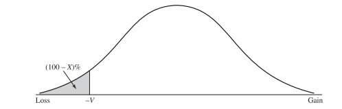
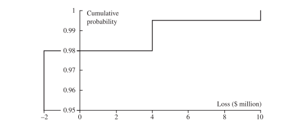
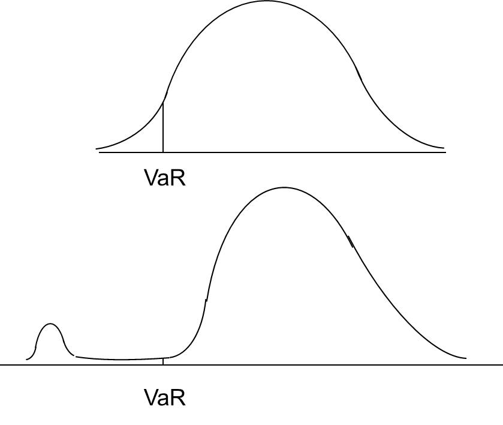
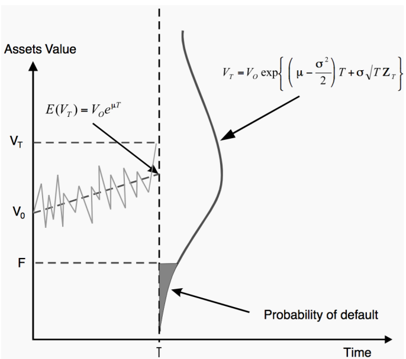

## Цели лекции

-   понять, что такое Value-at-Risk (VaR) и Expected Shortfall (ES)
-   изучить непараметрические и параметрические подходы к оценке VaR и
    ES
-   научиться оценивать доверительные интервалы VaR и ES с помощью
    бутстрапа
-   оценить VaR и ES для портфеля бумаг
-   понять основные ограничения, связанные с традиционными метриками в
    риск-менеджменте
-   понять основные методы и подходы к оценке кредитного риска

```{r setup, cache=FALSE, echo=FALSE, message=FALSE, warning=FALSE}
library("RColorBrewer")    # brewer.pal
library("knitr")           # opts_chunk
library(forecast)
library(QuantTools)
library(xts)

# color palette
palette(brewer.pal(6, "Set1"))

opts_chunk$set(fig.width=12, fig.height=7)
opts_chunk$set(cache=TRUE, fig.align="center", comment=NA, echo=TRUE, tidy=FALSE)

# преобразовать объект xts в dataframe с сохранением индекса даты
XtstoDf <- function(ts, ...){ 
  df <- as.data.frame(ts)
  df$date <- time(ts)
  return(df)
}
load('../.RData')
par(las=0)

#Газпром, Сбербанк, ГМК Норникель
# 
# start.date = as.Date('2012-01-01')
# end.date = Sys.Date()
# GAZP <-  quant_tools_to_xts(get_finam_data('GAZP', from = '2012-01-01', to = Sys.Date()))
# SBER <-  quant_tools_to_xts(get_finam_data('SBER', from = '2012-01-01', to = Sys.Date()))
# GMKN <-  quant_tools_to_xts(get_finam_data('GMKN', from = '2012-01-01', to = Sys.Date()))
# GAZP.rtn <- diff(log(GAZP$close))
# SBER.rtn <- diff(log(SBER$close))
# GMKN.rtn <- diff(log(GMKN$close))
# rtns <- merge(GAZP.rtn, SBER.rtn, GMKN.rtn)
# names(rtns) <- c("GAZP", "SBER", "GMKN")
# rtns <- rtns[-1,]

```

## Зачем нужен риск-менеджмент?

Есть много типов финансового риска:

-   **Рычочный риск** -- возникает из-за изменения рыночных цен на
    финансовые активы
-   **Кредитный риск** -- риск того, что противоположная сторона по
    кредиту не выполнит свои контрактные обязательства, и кредитор не
    вернет тело долга и/или процентные платежи, связанные с ним.\
-   **Риск ликвидности** -- потенциальные издержки в связи с тем, что
    ликвидация позиции произойдет тогда, когда будет сложно найти
    покупателей.
-   **Операционный риск** -- риск человеческих ошибок, риск
    мошенничества, риск технических сбоев и проч.

Оценка риска является обязательной частью процесса принятия финансовых
решений.

## Общие подходы к риск-менеджменту финансовых организаций

-   **Декомпозиция риска** -- идентификация каждого риска и управление
    ими в отдельности.\
-   **Аггрегирования риска** -- управление риском за счет
    диверсификации. К примеру, для страховой компании, которая продает
    полисы КАСКО, выплаты по любому из полисов почти непредсказуемы. В
    то же время общие выплаты для пула из 100 тыс. страховок можно
    предсказать довольно точно.

## Меры риска

-   Любая финансовая позиция может быть представлена как случайная
    величина -- $X$.
-   К примеру, вы купили 1000 акций компании А по цене 100 рублей. Тогда
    потенциальный убыток, который вы можете понести будет рассчитываться
    как:

$$ X = 1000 \times (Y - 100) $$ где $Y$ -- цена акции завтра. Горизонт
оценки -- 1 рабочий день.

-   $X$ -- случайная величина, так как величина $Y$ неизвестна сегодня.
-   Риск-метрики для оценки величины убытка основываются на
    распределении этой случайной величины.
-   Риска-метрика -- это обобщающая статистика для распределения
    убытков.
-   Существует множество вариантов риск-метрик, которые обобщают
    распределение убытков.

## Value-at-Risk (VaR)

-   VaR использует два входных параметра -- **временной интервал**
    (временной горизонт оценка) и **доверительный интервал** ($T$ и
    $1-\alpha$).
-   При этих заданных входных параметрах, VaR оценивает границу, которая
    определяет потенциальный убыток в течение временного горизонта с
    уровнем вероятности, не превышающим доверительный интервал.
-   К примеру, если горизонт T = 1 неделя, доверительный коэффициент =
    99% (то есть $\alpha = 0,01$) и VaR составляет 5 млн рублей. Это
    означает, что существует вероятность в 1%, что убыток в течение
    недели превысит 5 млн рублей.

Если $L$ -- убыток в течение горизонта $T$, то $VaR(\alpha)$ -- это
верхняя квантиль функции распределения $L$. Для непрерывно функции
распределения $VaR(\alpha)$ решает следующее уравнение:

$$ P\{L> VaR(\alpha)\} = \alpha $$

## Основной вопрос, на который отвечат VaR

**"Какой уровень потерь, что мы на X% уверены, что он не будет превышен
в течение срока T"?**

Регуляторы используют VaR для оценки капитала, который необходим банкам.
К примеру, в рамках Базеля 2 оценка рыночного риска оценивается на
основе 10 дневного VaR с вероятностью в 99%. Кредитный риск стандартно
оценивается на основе 1-летнего VaR с вероятностью в 99,9%.

## Value-at-Risk (Var) на основе функции плотности распределения прибыли

Оценка VaR на основе плотности распределения прибыли. Уровень VaR равен
V.

::: {align="center"}

:::

## Value-at-Risk (Var) на основе функции распределения (CDF)

Проект сроком на 1 год имеет 98% вероятность прибыли в 2, вероятность
1,5% получить потери в размере 4 млн и 0,5% вероятности привести к
потере 10 млн.

::: {align="center"}

:::

VaR с доверительным уровнем 99% и годичным горизонтом составляет 4 млн.

## Потенциальные проблемы VaR

Плюсы VaR:

-   охватывает существенные аспекты риска в одном числе
-   его легко интерпретировать
-   отвечает на простой вопрос для руководства: **"На сколько плохо
    могут пойти дела?"**

но у VaR есть серьезные минусы

::: {align="center"}

:::

## Expected shortfall (ES)

-   VaR помогает определяет уровень убытка, который превысит заданную
    вероятность, но не говорит о том, какой это может быть убыток.
-   То есть, VaR ничего не говорит о "хвосте" распределения, поэтому
    имеет свои ограничения.
-   ES определяет потенциальный размер убытка, если он превысит VaR.
    Математически это выражает как:

$$ ES(\alpha)  = \frac{\int_0^{\alpha} VaR(u)du}{\alpha} $$

-   ES отвечает на следующий вопрос: **"Если дела пойдут плохо, каков
    наши ожидаемый размер потерь?"**

## VaR с нормально распределенным убытком

Предположим, что ожидаемая доходность акции составляет 0,04 и
среднеквадратичное отклонение равно 0,18.

Если вы купили акций этой компании на 100 тыс. рублей, какой будет VaR
при горизонте в 1 год?

Предположим, что функция распределения **убытка** распределена нормально
с ожидаемым значением 4 тыс. рублей и СКО равным 18 тыс. рублей.

Тогда VaR будет равен:

$$4000 + 18 000 z_{\alpha} $$ где $z_{\alpha}$ -- верхняя
$\alpha$-квантиль распределения нормального распределения.

```{r}
r = 0.04
sig = 0.18
P = 100000
P*r
P*sig
alpha = seq(.0025,.25,by=.002)
var = P*r + P*sig*qnorm(1-alpha)

```

## VaR с нормально распределенным убытком - 2

```{r}
plot(alpha,var,type="l",xlab=expression(alpha),
     ylab=expression(paste("VaR(",alpha,")")))

min(var);max(var)

```

-   Как видно из графика, VaR зависит от $\alpha$. На графике величина
    VaR меняется в диапазоне от 54256,61 ($\alpha = 0,025$) до 16225.94
    ($\alpha = 0,25$)

## Оценка VaR и ES для одного актива

-   Наиболее простой случай -- один актив в портфеле.
-   Мы будем оценивать параметры риска на основе **исторических
    данных**. Это означает, что мы делаем неявное допущение о том, что
    параметры доходности стационарны (по крайней мере, на горизонте
    оценки). Это стандартное допущение.
-   Другое допущение -- доходности являются независимыми (отсутствие
    автокорреляции). Это допущение гораздо более серьезное. Мы затем его
    можем ослабить, используя GARCH-модели или другие подходы для оценки
    волатильности.

## Непараметрическая оценка VaR и ES для индексного фонда

Предположим, что ваша позиция это 1 млн рублей, вложенный в индексный
фонд ММВБ.

Вы хотите оценить VaR на 1 день.

Построим график ежедневных доходностей индекса ММВБ в 2010-2021 гг.

```{r, cache=FALSE}
plot(MICEX.rtn, main = 'Дневные доходности индекса MOEX')
```

## Непараметрическая оценка VaR и ES для индексного фонда -- 2

```{r}
alpha = 0.05  # доверительный интервал
q <-  as.numeric(quantile(MICEX.rtn, alpha, na.rm = TRUE ))
q
Var_nonp <- -10^6 * q # непараметрический VaR
IEVar =  MICEX.rtn < q # вектор логических переменных, равен TRUE, если величина доходности меньше квантили 
ES_nonp = -10^6 * sum(MICEX.rtn * IEVar, na.rm = TRUE) / sum(IEVar, na.rm = TRUE) # суммируем и считаем среднее значение убытка
ES_nonp # непараметрическая оценка ES

```

5%-ая квантиль данного распределения доходностей равна -1,7%.

Это означает, что на исторических данных дневная доходность, превышающая
-1,7%, наблюдалась в менее чем 5% времени.

Таким образом, мы можем оценить, что существует 5% вероятность, что
убыток такого размера может возникнуть на следующий день.

$$\hat{VaR}(0,05, 1д) = 10^6 * 0,017 = 17065.52 $$ ES рассчитывается
путем усреднения всех доходностей, которые были меньше 1,7% и умножения их
на величину портфеля. В нашем случае $ES(0,05) = 26740.31$

## Параметрическая оценка VaR и ES

Параметрическая оценка дает несколько преимуществ по сравнению с
непараметрической оценкой:

1.  Параметрическая оценка дает возможность использовать GARCH-модели
    для того, чтобы адаптировать оценки риска с текущими значениями
    волатильности.
2.  Оценка риска становится возможным оценивать для портфеля бумаг, если
    мы зададим допущение по поводу их совместного распределения.
3.  Непараметрические оценки работают "хорошо", если у нас имеется
    достаточно длинная история наблюдений и если $\alpha$ достаточно
    большая. При малых выборках и небольших размерах $\alpha$
    рекомендуется использовать параметрические оценки риска.

## Параметрическая оценка VaR и ES --2

Пусть $F(y|\theta)$ -- параметрическое семейство распределений,
используемое для моделирования доходностей.

$\hat{\theta}$ оценка $\theta$, оцененная, к примеру, методом
максимального правдоподобия на основе исторических данных.

Тогда $F^{-1}(\alpha|\hat{\theta})$ представляет собой оценку
$\alpha$-квантили распределения доходностей на основе обратной
эмпирической функции распределения.

VaR будет определяться как:

$$\hat{VaR}^{par}(\alpha) = -S \times  F^{-1}(\alpha|\hat{\theta}) $$
$S$ -- текущая величина нашей позиции.

Оценка ES будет рассчитываться как:

$$\hat{ES}^{par} = - \frac{S}{\alpha} \times \int_{-1}^{F^{-1}(\alpha|\hat{\theta})}x f(x| \hat{\theta}) dx$$
В общем случае рассчитать этот интеграл может быть сложно, но для
случаев нормального распределения и распределения Стьюдента существуют
удобные аналитические формулы для расчета.

## Распределение Стьюдента (t-распределение)

-   t-распределение Стьюдента -- это непрерывное одномерное
    распределение с **одним параметром** - количеством степеней свободы
    (df), $\nu$. t-критерий (отношение разницы между выборочным средним
    и известным значением к стандартной ошибке выборочного среднего)
    имеет распределение Стьюдента.
-   Отличием является то, что хвосты распределения Стьюдента медленнее
    стремятся к нулю, чем хвосты нормального распределения
-   Классическое распределение Стьдента симметрично и имеет один пик.
    Его среднее арифметрическое всегда равно нулю, а дисперсия
    определется параметром df.

```{r}
x = seq(-4,4, by=0.01)
plot(x, dt(x, df=10), type = 'l', main='Распределение Стьюдента с разными df и нормальное распределение')
lines(x,dt(x,df = 5), col = 'red')
lines(x,dt(x,df = 1), col = 'blue')
lines(x,dnorm(x), col = 'green', lwd = 2)
```

## Не-стандартизированное t-распределение Стьюдента

-   Обычно реальные данные сложно моделировать непосредственно
    распределением Стьюдента. Поэтому на практике использует
    не-стандартизированное распределение, которое представляет собой
    линейную комбинацию классического распределения с помощью параметров
    расстония (location) $\mu$ и масштаба (scale) -- $\sigma$.

$$X = \mu + \sigma T $$ или $T = \frac{X- \mu}{\sigma}$ -- имеет
классическое t-распределение.

Таким образом, не-стандартизированное t-распределение Стьюдента имеет
три параметра -- $\nu, \mu, \sigma$. В данном случае $\sigma$ не
является среднеквадратическим отклонением, а параметром масштаба
распределения (scale parameter)

Другие характеристики не-стандартизированного распределения Стьдента:

$$ E(x) = \mu $$ $$ Var(x) = \sigma^2 \frac{\nu}{\nu-2}$$

## Параметрическая оценка VaR и ES в R

Посчитаем параметрические оценку VaR и ES в R, предположив, что
доходность индекса имеет **не-стандартизированное распределение
Стьюдента** (i.i.d.). В рамках этого допущения VaR будет определяться
как:

$$\hat{VaR}^t = -S \times \{ \hat{\mu} + q_{\alpha,t} (\hat{\mu}) \hat{\sigma} \} $$
где $\hat{\mu}, \hat{\sigma}, \hat{\mu}$ -- выборочные значения
среднего, коэффициента масштаба (scale parameter), индекса степенй
свободы (tail index), соответственно.

$q_{\alpha,t} (\hat{\mu})$ -- $\alpha$-квантиль распределения Стьюдента
с заданным параметром $\mu$.

В нашем случае для доходностей индекса MOEX:

$$ \hat{\mu} = 0.0004702794, \hat{\sigma} = 0.0101840885, \hat{\nu} = 5.16 $$

```{r, warning=FALSE, message=FALSE}

n = nrow(MICEX.rtn)
alpha = 0.05
library(MASS)
fitt <- fitdistr(MICEX.rtn,"t") # функция для оценки различных одномерных распределения с помощью MLE из пакета MASS
param <-  as.numeric(fitt$estimate)
mean <-  param[1]
df <-  param[3]
sd <-  param[2]*sqrt( (df)/(df-2) ) #расчет стандартного отклонения через scale и df по формуле
sigma <-  param[2]
qalpha <-  qt(alpha,df=df) # квантиль-функция для распределения Стьюдента (t)
VaR_par <-  -10^6 *(mean + sigma*qalpha)

es1 <-  dt(qalpha,df=df)/(alpha)
es2 <-  (df + qalpha^2) / (df - 1)
es3 = -mean+sigma*es1*es2

ES_par <-  10^6 *es3
VaR_par
ES_par

```

Параметрическая оценка VaR (16935) близка к непараметрической оценке
(17065), но несколько меньшее ее. Параметрическая оценка ES = 24486, что
меньше чем не-параметрическая оценка ES (26740). Это связано с тем, что
наиболее левая часть распределения доходностей (90 из 1782 наблюдений)
является более тяжелой по сравнению с распределением Стьюдента с df =
5.16

Формула ES для распределения Стьюдента, используемая в расчете:

$$\hat{ES}^t = S \times \{ -\mu + \sigma  \frac{f_{_\nu}F_{\nu}^{-1}(\alpha)}{\alpha}[\frac{\nu+\{F_{\nu}^{-1}(\alpha)\}^2\}}{\nu-1}] \} $$

## График квантиль-квантиль для t-распределения

Красная линия -- график квантилей распределения Стьюдента с
зафиксированным значением df = 5.16

Точки - точки наблюдений исторической доходности.

В левой нижней части графика красная линия находится ниже точек. Это
означает, что распределение Стьюдента имеет менее тяжелый хвост по
сравнению с эмпирическими наблюдениями.

```{r}
grid = (1:n)/(n+1)
qqplot(coredata(MICEX.rtn), qt(grid,df=5.16),main="Распределение Стьюдента, df=5.16",xlab="данные",ylab="t-квантили")
abline(lm(qt(c(.25,.75),df=5.16)~quantile(MICEX.rtn,c(.25,.75))), col = 'red', lwd = 2)

```

## Бутстрап-оценки доверительных интервалов VaR и ES

Оценка VaR и ES -- это только оценки. Если мы будем использовать другие
временные периоды мы будем получать другие оценки риска. Мы посчитали
точность VaR до второго знака после запятой, однако на сколько мы на
самом деле можем быть **уверены** в этих оценках?

Для оценки доверительных интервалов VaR и ES мы можем использовать метод
**бутстрапа**.

В бутстрапе мы из имеющейся выборки случайным образом формируем
под-выборку с репликацией (то есть одни и теж же значения имеют шансы
попасть в под-выборку несколько раз) и оцениваем параметры.

Мы будем создавать выборки с репликацией из нашего ряда доходностей
(размера 1000) и проводить ту же самую процедуру -- непараметрическую
оценку и параметрическую оценку VaR и ES и сохранять полученные
значения.

## Бутстрап-оценки доверительных интервалов VaR и ES в R

Выполнение кода занимает около 5 минут даже на современном
производительном компьютере -- бустрап оценки имеют "вычислительную"
цену.

```{r, cache=TRUE, eval = FALSE}
B = 1000 # количество выборок
VaRs=matrix(0,nrow=B,ncol=4) # матрица для хранения значений риск-метрик
alpha = 0.05
set.seed(1234)

for (i in (1:B))
{
  returns_b = sample(MICEX.rtn,1000,replace=TRUE) # бутстрап-выборка 
  q_b = as.numeric(quantile(returns_b,.05))
  VaR_nonp_b = -10^6*q_b
  IEVaR_b = (returns_b < q_b)
  ES_nonp_b = -10^6 * sum(returns_b*IEVaR_b) / sum(IEVaR_b)
  
  fitt_b = fitdistr(returns_b,"t")
  param_b = as.numeric(fitt_b$estimate)
  mean_b = param_b[1]
  df_b = param_b[3]
  sd_b = param_b[2]*sqrt( (df_b)/(df_b-2) )
  lambda_b = param_b[2]
  qalpha_b = qt(.05,df=df_b)
  VaR_par_b = -10^6*(mean_b + lambda_b*qalpha_b)
  es1_b = dt(qalpha_b,df=df_b)/(alpha)
  es2_b = (df_b + qalpha_b^2) / (df_b - 1)
  es3_b = -mean_b+lambda_b*es1_b*es2_b
  ES_par_b = 10^6*es3_b
  VaRs[i,]=c(VaR_nonp_b,VaR_par_b,ES_nonp_b,ES_par_b)
  cat('итерация', i)
}


```

## Бутстрап-оценки доверительных интервалов VaR

Посмотрим на распределение полученных оценок риска:

```{r}
hist(VaRs[,1], breaks = 50, main = 'Non-parametric VaR (bootstrap)', xlab= 'рублей')
hist(VaRs[,2], breaks = 50, main = 'Parametric VaR (bootstrap)', xlab= 'рублей')
```

-   Как видно, оценка VaR и ES имеют достаточно широкие доверительные
    интервалы, то есть в полученных точечных оценках есть значительная
    неопределенность.
-   Для непараметрических оценок доверительные интервалы имеют более
    "рваный" характер.

## Бутстрап-оценки доверительных интервалов ES

```{r}
hist(VaRs[,3], breaks = 50, main = 'Непараметрическая оценка ES (bootstrap)', xlab= 'рублей')
hist(VaRs[,4], breaks = 50, main = 'Параметрическая оценка  ES (bootstrap)', xlab= 'рублей')

```

## Оценка VaR и ES для портфеля бумаг

-   Обычно в портфеле находится не одна, а много бумаг.
-   Если мы оцениваем риск-метрики не для одного, а для нескольких
    бумаг, необходимо задать допущении об их совместном распределении.
-   Обычно это многомерное нормальное или **многомерное
    t-распределение**. Это удобно, так как распределение доходностей
    портфеля будет также будет иметь нормальное или t-распределение.

Мы можем использовать подходы из портфельного анализа, чтобы оценить
среднее и дисперсию портфеля бумаг для того, чтобы оценить VaR и ES.

## Двумерное распределения Стьюдента для доходностей SBER и GAZP

-   Для многомерного t-распределение мы также задаем матрицу ковариаций,
    которые определяют связи между переменными
-   Распределение Стьюдента часто используется в финансах из-за более
    тяжелых хвостов
-   Величина df определяет, на сколько тяжелые хвосты. Чем меньше df,
    тем они более тяжелые.

```{r, cache=TRUE, warning=FALSE, message=FALSE}
library(mvtnorm)
library(mnormt)
library(rgl)
rtns2 <- rtns[,1:2] # две бумаги - Газпром и Сбербанк
mu <- c(mean(rtns2[,1], na.rm = TRUE), mean(rtns2[,2], , na.rm = TRUE)) # вектор средних
Sigma <- cov(rtns2, use = "complete.obs")   # матрица ковариаций
set.seed(1234)
bivn <- mvrnorm(5000, mu = mu, Sigma = Sigma )  # cимулируем многомерное нормальное

bivn.t <- rmt(5000, mu, Sigma, df = 3.45) # симулирование данных. df нашли методом MLE

```

## График двумерного распределения доходностей SBER и GAZP -- Cтьюдент и нормальное

Если мы сравним симулированные значения многомерного нормального и
t-распределения, то увидим, что нормальное распределение - горадо более
"сжато" относительно среднего значения.

```{r}
par(mfrow=c(1,3))
plot(bivn.t[,1], bivn.t[,2], main = 'Двумерное t-распределение', xlab = 'GAZP', ylab='SBER')
plot(bivn[,1],bivn[,2],main = 'Двумерное нормальное распределение', xlab = 'GAZP', ylab='SBER', 
     ylim=c(-.4,0.4), xlim = c(-0.3, 0.5))

plot(coredata(rtns[,1]),coredata(rtns[,2]),main = 'Исторические данные', xlab = 'GAZP', ylab='SBER', 
     ylim=c(-.4,0.4), xlim = c(-0.3, 0.5))

par(mfrow=c(1,1))

```

## 3D график двумерного распределения Стьюдента для доходностей SBER и GAZP

Мы можем построить красивый трехмерный график, который показывает
плотностей двумерного распределения Стьюдента с эмпирическими
параметрами.

```{r}
bivn.kde <- kde2d(bivn.t[,1], bivn.t[,2], n = 100)  #оценка двумерного ядра (kernel) плотности распределения 
col2 <- heat.colors(length(bivn.kde$z))[rank(bivn.kde$z)] # регулирование цвета
persp3d(x=bivn.kde, col = col2, xlab="GAZP", ylab = 'SBER')
rglwidget(width=800, heigh=600)  

```

## Оценка VaR и ES для портфеля бумаг в R

-   Пусть у нас есть портфель из трех акций -- Газпром, Сбербанк, ГМК
    Норникель.
-   Стоимость портфеля = 1 млн рублей, распределенных равными долями. То
    есть доля каждой бумаги в портфеле равна 1/3
-   Оценим VaR и ES для данного портфеля с допущением, что доходности
    бумаги имеют многомерное t-распределение.

```{r, cache = TRUE, warning=FALSE, message=FALSE}
library(mnormt)

alpha = .05

rtns3 <- rtns[,1:3]
rtns3 <- rtns3[-(1:2),]
cor(rtns3, use = "complete.obs") # матрица корреляций 3 бумаг

df = seq(2.0,7.0,.05) # вектор возможных первоначальных значений параметра тяжести хвоста (tail index)

n = length(df)
loglik = rep(0,n)

# найдем параметр df, который максимизирует log-likelehood
for(i in 1:n){
  fit = MASS::cov.trob(rtns3,nu=df) # оценка матрицы ковариации для многомерного t-распределения - функция из пакета MASS
  loglik[i] = sum(log(dmt(rtns3,mean=fit$center,S=fit$cov,df=df[i])))
}
indicate = (1:length(df))[ (loglik== max(loglik)) ]
dfhat = df[indicate] # максизирующей LL значение df

estim = MASS::cov.trob(rtns3, nu=dfhat, cor=TRUE) # оценка матрицы ковариации для многомерного t-распределения
options(digits=3)
muhat = estim$center
covhat = estim$cov
dfhat;muhat;covhat # основные параметны многомерного распределения
w = rep(1/3,3) # равные веса в портфеле 

muP = as.numeric(w %*% muhat) #ожидаемая доходность портфеля
varP = as.numeric(w %*% covhat %*% w) #дисперсия портфеля
sdP = sqrt(varP) # с.к.о. портфеля
muP
sdP

sigmaP = sqrt((dfhat-2)/dfhat) * sdP # параметр лямбда для распределения Стьюдента
sigmaP

VaR = -(muP + sigmaP* qt( alpha, dfhat))
10^6*VaR

qalpha = qt(alpha,df=dfhat)
es1 = dt(qalpha,df=dfhat)/(alpha)
es2 = (dfhat + qalpha^2) / (dfhat - 1)
es3 = -muP+sigmaP*es1*es2
ES_par = 10^6*es3
ES_par

```

## Кредитный риск

-   **Кредитный риск** -- фактического риск того, что стоимость портфеля
    кредитов изменится из-за ухудшения "качества" заемщиков и кредитор
    не сможет вернуть часть средств.
-   Регуляторы требуют, чтобы банк поддерживал достаточный уровень
    капитала для покрытия кредитного риска.
-   Согласно Базельским правилам, банки могут, с разрешения регулятора,
    использовать собственные оценки вероятностей дефолта для оценки
    требуемого уровня капитала
-   **Подход, основанный на внутренних рейтингах (ПВР)** -- дает
    возможность банку использовать собственные параметры для оценки
    кредитного риска (с одобрения регулятора).
-   Одним из основных параметров оценки кредитного риска является
    вероятность дефолта

## Как можно оценивать вероятности дефолта?

**Модель Альтмана**. В 1968 году Эдвард Альтман предложил использование
бухгалтерских показателей для расчета вероятностей дефолта. Для публично
торгуемыех промышленных компаний оригинальная формула Альтмана выглядела
следующим образом:

$$Z = 1.2 \cdot X_1 + 1.4 \cdot X_2 + 3.3 \cdot X_3 + 0.6 \cdot X4 + 0.999 \cdot X5   $$

$$X_1=Working Capital/Total Assets$$
$$ X_2=Retained Earnings/Total Assets$$ $$X_3=EBIT/Total Assets$$
$$ X_4=Market Value of Equity/Book Value of Liabilities$$
$$X5=Sales/Total Assets$$

Если значение Z\> 3.0, то дефолт маловероятен; если 2.7 \<Z \<3.0, это
повод насторожится. Если 1,8 \<Z \<2,7, существует умеренная вероятность
дефолта; если Z \<1,8, то существует высокая вероятность дефолта.

НО модель Альтмана была разработана 50 лет назад, коэффициенты
оценивались на выборке компаний США.

## Использование исторических данных

-   Исторические данные, которые предоставляют рейтинговые агентства,
    можно использовать для оценки вероятности дефолта.

**Накопленные средние уровни дефолтов, % (1970-2013, Moody's)**

|     | Время лет) |        |        |        |        |        |        |
|-----|------------|--------|--------|--------|--------|--------|--------|
|     | 1          | 2      | 3      | 4      | 5      | 7      | 10     |
| Aaa | 0          | 0.013  | 0.013  | 0.037  | 0.104  | 0.241  | 0.489  |
| Aa  | 0.022      | 0.068  | 0.136  | 0.26   | 0.41   | 0.682  | 1.017  |
| A   | 0.062      | 0.199  | 0.434  | 0.679  | 0.958  | 1.615  | 2.759  |
| Baa | 0.174      | 0.504  | 0.906  | 1.373  | 1.862  | 2.872  | 4.623  |
| Ba  | 1.11       | 3.071  | 5.371  | 7.839  | 10.065 | 13.911 | 19.323 |
| B   | 3.904      | 9.274  | 14.723 | 19.509 | 23.869 | 31.774 | 40.56  |
| Caa | 15.894     | 27.003 | 35.8   | 42.796 | 48.828 | 56.878 | 66.212 |

В таблице показана вероятность дефолта (PD) для компаний, начинающих с
определенного кредитного рейтинга. Компания с первоначальным кредитным
рейтингом **Baa** имеет вероятность 0,174% дефолта к концу первого года,
0,504% к концу второго года и так далее.

Для компании, которая начинает с хорошего кредитного рейтинга,
вероятности дефолта со временем увеличиваются. Для компании, которая
начинает с низкого кредитного рейтинга, вероятности дефолта со временем
снижаются.

> В России многие компании не имеют кредитных рейтингов от международных рейтинговых агентств.

Каждый год на основе матриц миграции (из одного в рейтинга другой) можно рассчитать вероятности дефолта на определенный горизонт. 

Credit VaR определяется как: 

$$1 - \alpha-quantile (Credit Loss) - ExpectedLoss $$

## Модель Мертона

Модель Мертона рассматривает капитал фирмы как опцион на его активы. В
простейшем случае стоимость капитала фирмы равна $max(V_T- D, 0)$, где
$V_T$ -- стоимость активов фирмы, $D$ -- долг.

См. *R. Merton, "On the Pricing of Corporate Debt: The Risk Structure of
Interest Rates," Journal of Finance 29 (1974): 449--470.*

-   Модели ценообразования опционов позволят оценивать стоимость
    капитала фирмы сегодня ($E_0$) как функцию от стоимости активов
    "сегодня" ($V_0$) и волатильности активов ($\sigma_V$).

## Графическое представление модели Мертона

::: {align="center"}

:::

## Формулы в модели Мертона

Можно использовать формулу Блека-Шоулза-Мертона для оценки стоимости
опциона колл, где цена страйка равна размеру долга:

$$E_0 = V_0 \cdot N(d_1)  - D e^{-rT} \cdot N(d2)$$

где
$$ d_1 = \frac{ln(V_0/D)+rf + 1/2 \cdot \sigma_V^2 \cdot T }{\sigma_V \cdot \sqrt{T} }$$
$$d_2 = d_1 - \sigma_V \cdot \sqrt{T} $$ $N$ -- функция нормального
распределения

Если {V_T \< D}, то тогда компания объявляет дефолт, а стоимость
капитала становится равной нулю. Вероятность этого согласно модели,
будет составлять $N(-d_2)$.

Мы не можем наблюдать $V_0$ и $\sigma_V$ напрямую, но если компания
торгуется на рынке, то мы можем наблюдать $E_0$. Можно показать, что

$$\sigma_E E_0 = \frac{dE}{dV}\sigma_V V_0 $$ так как
$\frac{dE}{dV} = N(d_1)$, то можно записать как

$$ \sigma_E E_0 = N(d1) \sigma_V V_0  $$

## Пример расчета по модели Мертона

**Задача**. Компания имеет капитал в 3 млрд рублей. Волатильность
капитала составляет 80%. Безрисковая ставка составляет 5%. Уровень долга
равен 10 млрд рублей. Срок до погашения долга составляет 1 год.

**Решение**. $E_0 = 3, \sigma_E = 0.8, r = 0.07, T = 1, D = 10$.

Тогда решая систему из двух не-линейных уравнений, мы можем найти, что
$V_0 = 12.4$ и $\sigma_V = 0.2123$. Параметр $d_2$ равен 1.1408. Тогда
вероятность дефолта равна $N(d_2) = 12.76%$.

## Credit Value at Risk (Credit VaR)

-   Credit VaR определяется аналогичным образом Market Risk VaR.

-   1-летний Credit VaR c вероятностью 99,9% определяет, что мы на 99,9%
    уверены, что убыток в течение года не превысит значение VaR.

-   Для большого портфеля кредитов каждый из которых имеет вероятность
    дефолта $PD$ за время $T$ максимальный показатель дефолта (worst
    case default rate - WCDR), который не будет превышен с уверенность в
    %X, можно определить по формуле

$$WCDR = N(\frac{N^{-1}[PD]+\sqrt{\rho}N^{-1}(X)}{\sqrt{1-\rho}}) $$ где
$\rho$ -- коэффициент корреляции между кредитами.

Тогда

$$Credit VaR = WCDR \cdot EAD \cdot LGD $$ EAD -- exposure at default,
означает величину кредитных требований, подверженных риску потерь при
дефолте

LGD -- loss given default, доля потерь в случае дефолта, которая зависит
от обеспечения и прочих факторов.

## Вопросы для обсуждения

1.  Управляющий фондом сообщил, что 95%-ый VaR сроком на 1 месяц
    составляет 6%. Ваши инвестиции в фонд составляют 1 млн рублей. Как
    вы можете интепретировать информацию управляющего?

2.  Управляющий фондом сообщил, что 95%-ый ES сроком на 1 месяц
    составляет 6% от активов фонда. Ваши инвестиции в фонд составляют 1
    млн рублей. Как вы можете интепретировать информацию управляющего?

3.  Предположим у вас есть инвестиция, которая имеет 4% вероятность
    потерь в 10 млн, 2% потерь в 1 млн и 94% вероятность прибыли в 1
    млн. Какова величина VaR на уровне 95%? Какова величина ES на уровне
    95%?

## Список использованных источников

1.  "Statistics and Data Analysis for Financial Engineering" (David
    Ruppert & David Matteson)
2.  "Analyzing Financial Data and Implementing Financial Models"
    (Clifford Ang).
3.  "An Introduction to Analysis of Financial Data with R" (Ruey Tsay)
