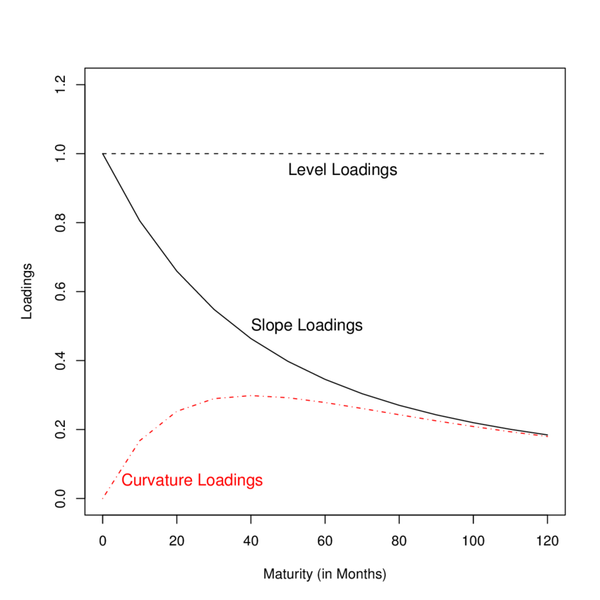

## Цели лекции

-   изучить основные характеристики облигаций
-   понять, что такое спотовые ставки
-   понять, что такое форвардные ставки и как они связаны с ценами на
    облигации
-   понять принципы непрерывного начисления доходностей
-   понять основные принципы построения моделей временной структуры
    процентных ставок
-   изучить модель Нельсона-Сигеля (Nelson-Siegel)
-   научиться оценивать модель Нельсона-Сигеля в R
-   изучить особенности расчета кривой бескупонной доходностей
    [Московской Биржей](https://www.moex.com/s2532)

```{r setup, cache=FALSE, echo=FALSE, message=FALSE, warning=FALSE}

library("RColorBrewer")    # brewer.pal
library("knitr")           # opts_chunk
library(forecast)
library(RCurl)
library(stringr)
if(!require(XML)){install.packages("XML")};require(XML)
if(!require(RCurl)){install.packages("RCurl")};require(RCurl)
if(!require(XMLSchema)){install.packages("XMLSchema", repos = "http://www.omegahat.org/R", dependencies = TRUE, type = "source")};require(XMLSchema)
if(!require(SSOAP)){install.packages("SSOAP", repos = "http://www.omegahat.org/R", dependencies = TRUE, type = "source")};require(SSOAP)
if(!require(xts)){install.packages("xts")};require(xts)


# color palette
palette(brewer.pal(6, "Set1"))

opts_chunk$set(fig.width=12, fig.height=7)
opts_chunk$set(cache=TRUE, fig.align="center", comment=NA, echo=TRUE, tidy=FALSE)

# преобразовать объект xts в dataframe с сохранением индекса даты
XtstoDf <- function(ts, ...){ 
  df <- as.data.frame(ts)
  df$date <- time(ts)
  return(df)
}
load('../.RData')
par(las=0)
```

## Повторение

-   Облигация -- по сути торгуемая форма займа. Эмитент облигации обязан
    выплатить номинальную стоимость, а также осуществлять купонные
    платежи. + Владелец облигации получается поток "фиксированных"
    платежей.
-   Даже если не происходит дефолта, владелец облигации несет риски,
    связанные с изменением процентных ставок.
-   Цены на облигации изменяются в **противоположном** направлении
    относительно изменения процентных ставок. Снижение процентных ставок
    приводит к росту цен на долговом рынке.

## Типы облигаций

-   **с нулевым купоном** (zero-coupon bonds). Заемщик к сроку погашения
    возвращает номинальную стоимость облигации.
-   **c фиксированным купоном** -- последовательность фиксированных
    платежей + возвращение номинала в конце срока погашения. Пример -
    ОФЗ и большинство корпоративных облигаций.
-   **с переменным купоном** -- купонные выплаты привязаны к
    определенным индикаторам (ставки денежного рынка, инфляция и проч.)
-   **консоль** -- "вечная" облигаций -- периодические выплаты
    неопределенное время, номинал не возвращается. Пример - некоторые
    облигации Великобритании.

## Облигации с нулевым купоном

Для облигации с номиналом в 1000 рублей номинальная стоимость равняется:

$$ = \frac{1000}{(1+i)^n} $$

Предположим, что $i = 10%$, тогда стоимость однолетней бумаги:

$$ = \frac{1000}{(1+0,1)^1} = 909,09 $$

стоимость 6-месячной бумаги равна:

$$ = \frac{1000}{(1+0,1)^{1/2}} = 953,46 $$

Стоимость 10-летней бумаги будет равна:

$$ = \frac{1000}{(1+0,1)^{10}} = 385,54 $$

## Облигации с фиксированным купоном

Эмитент облигации обещает осуществить серию периодических купонных
платежей, а также вернуть номинал в дату погашению.

$$ P_{cb} =  \frac{Coupon}{(1+i)^1} + \frac{Coupon}{(1+i)^2} + ... + \frac{Coupon}{(1+i)^n} + \frac{FaceValue}{(1+i)^n} $$

## Доходности облигаций

-   Мы умеем вычислять стоимость облигации, если знаем процентную ставку
    ($i$).
-   Мы можем также решать **обратную задачу** -- вычислить доходность,
    опираясь на рыночную цену облигации, которая известна.
-   Объединив информации по будущим выплатам (уникальные характеристики
    облигации) и ее рыночную цену -- мы можем получить **доходность
    (yield)**

## Доходность к погашению (yield-to-maturity)

-   Наиболее полезная оценка доходности владения облигации --
    **доходность к погашению** (доходность, которую получит владелец
    облигации, если будет держать облигацию до погашения).

К примеру, для 1-летней облигации с купоном в 5%:

$$ Price = \frac{50}{(1+i)} + \frac{1000}{(1+i)} $$

-   YTM -- это значение $i$, которое приравнивает уравнение к текущей
    цене облигации.
-   Если цена облигации равно 100% номинала, YTM = ставка купона
-   Если цена облигации \> 100% номинала, YTM \< ставка купона
-   Если цена облигации \< 100% номинала, YTM \> ставка купона
-   **Если цена облигации увеличивается, доходность к погашению
    снижается** -- цены и ставки двигаются в противоположные стороны

## Доходность к погашению (yield-to-maturity)

Оценим связь между ценой облигации и процентными ставками в R.

```{r, echo=FALSE, warning=FALSE,error=FALSE,message=FALSE,cache=FALSE,fig.width=10, fig.height=5}

bondvalue = function(c,T,r,par) 
{
  #   Computes bv = bond values (current prices) corresponding
  #       to all values of yield to maturity in the
  #       input vector r
  #
  #       INPUT
  #        c = coupon payment (semi-annual)
  #        T = time to maturity (in years)
  #        r = vector of yields to maturity (semi-annual rates)
  #        par = par value
  #
  bv = c/r + (par - c/r) * (1+r)^(-2*T)
  bv
}

price = 1200    #   current price of the bond
C = 40          #   coupon payment
T= 30           #   time to maturity
par = 1000      #   par value of the bond

r = seq(.03,.06,length=300)
value = bondvalue(C,T,r,par) 
yield2M = spline(value,r,xout=price) 

plot(r*100,value,xlab ='Доходность к погашению',ylab ='Цена облигации',type="l",
     main="Номинальная стоимость = 1000, купон = 40, платежей = 30",lwd=2)
abline(h=1000,col="red")
abline(v=yield2M,col="red")


```

## Cпотовые ставки (spot rates)

-   Доходность к погашению облигации с нулевым купоном с погашением
    через $n$ лет называется $n$-летней **спотовой ставкой** (spot
    rate).
-   Купонную облигацию можно представить как совокупность облигаций с
    нулевым купоном, по одной -- на каждый купон и с итоговым платежом,
    равным номинальной стоимости облигации.
-   Условие отсутствия арбитража (no arbitrage condition) приводит к
    тому, что два инструмента, которые имеют одинаковые потоки платежей,
    будут иметь одинаковую рыночную цену.

## Оценка цены и доходности к погашению купонной облигации -- пример

-   Предположим, что у нас есть 1-летняя купонная облигация с двумя
    полугодовыми платежами по 40 рублей и номинальной стоимостью в 1000
    рублей. Предположим, что текущая спотовая ставка на 6 месяцев
    составляет 5%/6мес. и текущая 12-месячная спотовая ставка 6%/6мес.
-   Тогда можно представить облигацию как сумму двух облигаций с нулевым
    купоном. У одной T = 1/2 и номинальная стоимость 40 рублей, у второй
    T = 1 и номинальная стоимость 1040 рублей.
-   Тогда цена этой облигации будет определяться как:

$$\frac{40}{1.05} + \frac{1040}{1.06^2} = 38,10 + 925,60 = 963,70  $$

-   Доходность к погашению для этой бумаги будет определяться как:

$$\frac{40}{y+1}  + \frac{1040}{(1+y)^2} = 963,70 $$ Решение этого
уравнение $y = 6,3$ (полугодовая доходность). Годовая доходность будет
равна 12,99%.

## Дюрация

-   Инструменты с фиксированной доходностью меняются в цене при
    изменении процентных ставок. Поэтому управление процентным риском
    является важной частью управления портфелем облигаций.

-   Оценка **дюрации** позволяет оценить чувствительность облигации к
    изменению процентных ставок. Стратегии immunization (выстраивание
    портфеля таким образом, чтобы дюрации активов и обязательств
    совпадали) позволяют снизить влияние процентного риска.

## Дюрация Макколея (Macaulay Duration)

Дюрация Макколея - средневзвешенный срок потока платежей, где весами
выступают дисконтированные стоимости платежей.

$$ MacalayD = \frac{\sum\limits_{t=1}^T{PV(CF_t)}}{P} $$ где $PV(CF)_t$
-- дисконтированный денежный поток в период времени t, $Price$ --
текущая цена облигации.

Дюрация будет всегда меньше или равна сроку до погашению облигации, при
этом дюрация будет равна сроку до погашения только бескупонных
облигаций.

Дюрация денежного потока зависит не только от его структуры, но и от
текущей процентной ставки. Чем выше ставка, тем меньше стоимость дальних
выплат по сравнению с короткими и тем меньше дюрация, и наоборот, чем
меньше ставка, тем больше дюрация потока платежей.

Фраза «дюрация облигации составляет 3 года» означает, что
рассматриваемая облигация имеет такую же чувствительность цены к
колебаниям процентных ставок, как 3-летняя бескупонная облигация.

Другая интерпретация дюрации -- среднее средневзвешенное количество лет,
которое инвестор должен держать облигацию для того, чтобы
дисконтированная стоимость денежных потоков облигации не сравнялась с
той ценой, которую заплатил инвестор.

**Модифицированная дюрация Макколея** -- показатель, характеризующий
реакцию цены облигации на изменение доходности к погашению.

$$ MD = \frac{MacalayD}{1+YTM}$$

при малых величинах будет выполняться равенство

$$ \frac{\Delta P }{P} \approx -MD * \Delta r$$

**Пример**. пусть модифицированная дюрация равна 4, облигация торгуется
по цене 90% с доходность 8%. НКД равен 0. Как изменится цена, если
доходность вырастет до 8.5% (изменение на 0.005).

Изменение цены можно будет вычислить следующим образом:
$-4 * 0.005 * 90=-1.8$. Цена облигации снизится на 1.8, до 88.2%
номинала.

## Накопленный купонный доход (НКД)

**Накопленный купонный доход** (accrued interest) -- величина,
измеряемая в денежных единицах, и характеризующая ту часть купонного
дохода, которая «накоплена» с начала текущего купонного периода.

Купон по облигациям платится периодически, обычно 1 раз в квартал,
полгода или год. Соответственно, после того, как очередной купон
выплачен и начался новый купонный период, купон начинает
«накапливаться».

Важность учета НКД обусловлена тем, что на большинстве рынков облигаций
они торгуются по т.н. «чистой цене», не включающей в себя НКД. Для того,
чтобы получить полную цену, которую покупатель облигации заплатит
продавцу (ее также называют «грязной» ценой), надо к чистой цене
прибавить НКД.

$$НКД = Coupon \frac{t_0 - t_{c-1}}{t_c - t_{c-1}} $$ где $t_0$ ---
текущая дата, $t_{с-1}$ -- дата начала купонного периода, $t_{с}$ --
дата дата выплаты ближайшего купона.

К примеру, если размер очередного купона по облигации составляет 50
рублей, дата начала купонного периода -- 01.04, дата окончания купонного
периода (выплаты купона) -- 01.10, то на момент 01.09 НКД составит
50\*153/183=41.80 рублей.

## Временная структура процентных ставок (term structure)

-   Временная структура процентных ставок -- это описание того, как в
    конкретный момент времени, доходность к погашению зависит от срока
    погашения.

Эмпирические наблюдения процентных ставок:

1.  Процентные ставки с разными сроками погашения изменяются вместе с
    течением времени, они не постоянны.\
2.  Кривая доходности имеет положительный наклон, если "короткие" ставки
    меньше, чем "длинные"" и имеет отрицательный наклон -- если
    наоборот.
3.  Кривая доходности обычно имеет положительный наклон
4.  Кривая доходностей достаточно устойчиво во времени и не меняется
    сильным образом за короткий период времени
5.  Короткая часть кривой доходности более волатильна, чем длинная часть
    кривой

## Временная структура процентных ставок (term structure)

Временная структура процентных ставок до $n$ лет погашению может
описываться любым из следующих параметров:

1.  **Цены облигаций** с нулевым купоном для 1 года, 2 лет, ..., $n$ лет
    -- $P(1), P(2), .., P(n)$
2.  **Спотовые ставки** (доходности к погашению облигаций с нулевым
    купоном) -- $y_1, y_2, ..., y_n$.
3.  **Форвардные ставки** -- $r_1, r_2,\ldots, r_n $ - где $r_i$ --
    это форвардная ставка, которая может быть зафиксирована для
    заимствования в $i$-ом году ($i = 1$ для следующего года) на
    определенный срок.

## Форвардные ставки

-   Форвардные ставки -- это ожидаемая сейчас, **процентная ставка в
    будущем**.
-   Форвардный контракт это соглашение, которое позволяет купить или
    продать актив в определенный день в будущем по фиксированной цене.
    Так как $r_1, r_3, ..$ -- это ставки, которые могут быть
    зафиксированы сейчас на будущее, они называются **форвардными**.
-   К примеру, форвардная ставка 1Y1Y определяет значение 1-летней
    процентной ставки через 1 год.
-   Если мы знаем, 1-летнюю ставки и 2-летнюю ставку, то мы фактически
    знаем форвардную ставку 1y1y. Почему?

## Определение цены облигации исходя из форвардных ставок

Пусть у нас есть следующие данные по форвардным ставкам:

\*\* Таблица. Форвардные процентные ставки на 3 года \*\*

| Год | Процентная ставка |
|-----|-------------------|
| 1   | 6                 |
| 2   | 7                 |
| 3   | 8                 |

Тогда 1-летняя бумага будет иметь цену, равную:

$$\frac{1000}{1+r_1} = \frac{1000}{1,06} = 943,40 = P(1) $$

2-летняя:

$$\frac{1000}{(1+r_1)(1+r_2)} = \frac{1000}{(1,06)(1,07)} = 881,68 = P(2) $$

3-летняя:

$$\frac{1000}{(1+r_1)(1+r_2)(1+r_3)} = \frac{1000}{(1,06)(1,07)(1,08)} = 816,37 = P(3) $$

## Определение доходности к погашению

Доходность к погашению будет определяться по традиционной формуле:

$$\frac{1000}{1+y_1} = 943,40 $$ то есть $y_1 = 0,06$

Для двухлетней бумаги:

$$\frac{1000}{(1+y_1)^2} = 881,68 $$

$$ y=\sqrt{\frac{1000}{881,68}}=0,065 $$ $y_3 = 0,07$. Проверьте!

Общая формула для определения форвардных ставок из спотовых:

$$ r_1 = y_1 $$

и

$$r_n = \frac{(1+y_n)^n}{(1+y_{n-1})^{n-1})}-1 $$

## Расчет форвардных ставок из цен на облигации

Пусть у нас имеется следующая информация по ценам на облигации с нулевым
купоном:

| Погашение, лет | Цена, рублей |
|----------------|--------------|
| 1              | 920          |
| 2              | 830          |
| 3              | 760          |

Тогда доходности к погашению будут определяться как:

$$y_1 = \frac{1000}{920} = 0,087 $$
$$ y_2 = \{\frac{1000}{830}\}^{1/2} = 0,0976$$
$$ y_3 = \{\frac{1000}{760}\}^{1/3} = 0,096$$ Тогда используя формулу:

$$r_1 = y_1 = 0,087$$
$$r_2 = \frac{(1+y_2)^2}{1+y_1}-1=\frac{1,0976^2}{1,0876}-1 =0,108  $$
$$r_3 = \frac{(1+y_3)^3}{(1+y_2)^2}-1=\frac{1,096^3}{1,0976^2}-1 =0,092  $$

Таким образом, общая формула будет иметь вид:

$$r_n = \frac{P(n-1)}{P(n)}-1 $$

## Расчет форвардных ставок на рынке ОФЗ

**Ставка 1y1y** - форвардная ставка на 1 год через 1 год, то есть это
текущие ожидаемое значение ставки на 1 год через 1 год.

```{r, cache=TRUE, warning=FALSE, echo=FALSE, message=FALSE}

require(highcharter)
require(RCurl)

OnDate <- as.Date('2018-01-01')
ToDate <- Sys.Date()

rates <- as.xts(gcurve[,-1], order.by = gcurve[,1])

rates1 <- rates$X1
rates2 <- rates$X2

rates <- merge(rates1, rates2)
names(rates) <- c('y1', 'y2')
rates$y1y1 <- ((rates$y2+100)/100)^2/((rates$y1+100)/100)*100-100
rates <- apply(rates,2, function(x) round(x,2))
rates <- as.data.frame(rates)

hc <- highchart() %>% 
   hc_xAxis(categories = as.Date(row.names(rates))) %>% 
   hc_add_series(name = "1 year", data = rates$y1) %>%
   hc_add_series(name = "2 year", data = rates$y2) %>% 
   hc_add_series(name = "1y1y", data = rates$y1y1)
lst <- list()
lst[[1]] <- hc

#htmltools::tagList(lst[1])

hc

```

## Форвардная и спотовая кривая доходностей

-   Спотовая и форвардные кривые доходностей отличаются по форме

```{r}


curve_new <- gcurve[nrow(gcurve),]
spot_curve <- curve_new[,-(1:3)]

names(spot_curve) <- str_remove_all(names(spot_curve), 'X')

t <- as.numeric(names(spot_curve))
spot_curve <- (as.numeric(spot_curve) + 100)/100
spot_curve <- data.frame(spot_curve = spot_curve)
spot_curve$t <- t
spot_curve$fwd_curve <- spot_curve$spot_curve

for(i in 2:nrow(spot_curve)){
   spot_curve[i,3] = (spot_curve[i,1]^i)/spot_curve[i-1,1]^(i-1)  
}
plot(x = spot_curve$t,  y = spot_curve$fwd_curve*100-100, type='l', xlab="лет", ylab="%", main = 'Кривая доходностей рынка ОФЗ (16 марта 2021 г.)')
lines(x = spot_curve$t, y = spot_curve$spot_curve*100-100, col = 'red')
legend("topright",legend=c("Спотовая кривая","Форвардная кривая"), col=c(1,2),lty=1)


```

## Различные формы спотовой кривой доходностей ОФЗ

На графике приведены формы кривой доходности ОФЗ в период 2017-2020 гг.
Как видно, форма кривой может быть различной.

```{r, echo=FALSE, cache=TRUE, warning=FALSE, message=FALSE}
require(tidyr)
require(ggplot2)
require(xts)
library(stringr)
#gcurve_all <- read.csv("lectures/data/gcurve.csv")
#names(gcurve_all) = c('date', 1:30)

#rates <- as.xts(gcurve[,-1], order.by = gcurve[,1])

rates.curve2 <-  (pivot_longer(gcurve, -tradedate,  names_to = "maturity", values_to = "rate"))
names(rates.curve2)[1] <- 'date'
rates.curve2$maturity <- as.numeric(str_remove_all(rates.curve2$maturity, 'X'))

rates.curve2$date <- as.Date(as.character(rates.curve2$date))
rates.curve2$maturity <- as.numeric(rates.curve2$maturity)
al <- as.numeric(max(rates.curve2$date)-rates.curve2$date)
rates.curve2$alpha <- (max(log(al))-log(al))/max(log(al))
rates.curve2$alpha[rates.curve2$alpha==Inf] = 1
rates.curve2$alpha <- rates.curve2$alpha/2

p <-  ggplot(rates.curve2, aes(x=maturity, y=rate, group = date))
p <- p + geom_line(aes(group = date, alpha = alpha))+theme_minimal()
p +  theme(legend.position="none")+xlab('лет')+ylab('%')

```

## Непрерывно начисляемые проценты (сontinously compounded rates)

Пусть у нас вложение 1000 рублей, которое принесет 10% через год. Как
сумма полученных средств зависит от скорости начисления процента?

| Начисление | Платежей | \% за период      |
|------------|----------|-------------------|
| Ежегодно   | 1        | 0.1               |
| Полгода    | 2        | 0.05              |
| Квартал    | 4        | 0.025             |
| Месяц      | 12       | 0.0083            |
| Неделя     | 52       | $\frac{0.1}{52}$  |
| День       | 365      | $\frac{0.1}{365}$ |
| $\infty$   | $\infty$ |                   |

$$ 1105.517 = 1000  e^{0.1} $$ Мы можем выразить наоборот: какова
текущая величина инвестициии, которая позволит получить нам 1000 рублей
при непрерывном начислении доходности:

$$1000 e^{-0.1} = 904.84 $$

## Непрерывное начисление процентов для облигации

-   В облигациях проценты начисляются в дискретные промежутки времени --
    рад в полгода, раз в квартал и так далее.
-   Предположим непрерывное начисление процентов с форвардными ставками
    $ r_1, r_2, \ldots, r_n $. Использование непрерывно начисляемых
    ставок облегчает расчет связей между форвардными ставками,
    доходности к погашению. Если $P(n)$ - цена облигации с нулевым
    купоном, которая выплатит 1000 рублей через $n$ лет, тогда будет
    определяться как:

$$P(n) = \frac{1000}{exp(r_1 + r_2 + \ldots + r_n)} $$
$$\frac{P(n-1)}{P(n)} = \frac{exp(r_1 + r_2 + \ldots + r_n)}{exp(r_1 + r_2 + \ldots + r_{n-1})} = exp(r_n)$$
$$log(\frac{P(n-1)}{P(n)})= r_n $$ Доходность к погашению n-летней
облигации ($y_n$) с нулевым купоном решает уравнение:

$$P(n) = \frac{1000}{exp(n y_n)}$$ тогда

$$y_n = \frac{(r_1 + r_2+ \ldots + r_n)}{n} $$ Соответственно можно
выразить форвардную ставку как:

$$r_n = n y_n - (n-1)y_{n-1}  $$

## Непрерывные форвардные ставки

-   До этого мы предполагали, что форвардные ставки меняются от года к
    году, но остаются неизменными для каждого отдельного года.
-   Это допущение мало реалистично, но облегчает понимание форвардных
    ставок.
-   Форвардные ставки можно моделировать с помощью функции, которая
    непрерывно зависит от времени
-   Предположим, что есть функция $r_t$ такая, что текущая цена
    облигации с нулевым купоном с погашением $T$ и номинальной
    стоимостью в 1 будет определяться как:

$$ D(T) = exp(- \int_{0}^{T}r(t)dt $$

## Дисконтная функция

$D(T)$ называется **дисконтной функцией**. Цена любой облигации с
нулевым купоном будет определяться как:

$$ P(T) = PAR \times D(T) $$ где $PAR$ -- номинальная стоимость к
погашению.

$$log(P(t)) = log(PAR)- \int_{0}^{T}r(t)dt$$

\#\#Пример дисконтной функции

```{r}

y = gcurve[nrow(gcurve),]
y <- y[,-1]
names(y) <- str_remove_all(names(y), 'X')
t = as.numeric(names(y))
y = (as.numeric(y)+100)/100
y
d <- rep(0,length(t))
for(i in 1:length(t)){
   d[i] = 1/y[i]^i
}
plot(t, d, type = 'l', main = 'Пример расчета дисконтной функции', xlab = 'лет до погашения', ylab = '')

```

## Оценка кривой процентных ставок как задача регрессии

Предположим, что существует несколько типов облигаций с нулевой
доходностью номиналом в 1000 рублей с несколькими разными сроками до
погашения ($T_i$.

Дходность к погашению для всех этих облигаций **одинаковая** и равна
$r$.

C условием постоянной величины $r$ для разных типов облигаций:

$$ P_i = 1000 exp(-r T_i) $$

где $i$ -- определяет разные выпуски облигаций.

Так существует определенная вариация в наблюдаемых ценах на облигации,
то можно включить случайную компоненту:

$$ P_i = 1000 exp(-r T_i) + \epsilon_i$$

Величину $r$ можно определить с помощью МНК, минимизируя сумму квадратов

$$\sum_{i=1}^n \{ P_i - exp(-r T_i) \} $$

## Оценка цен на облигации с постоянной доходностью ($r$)

-   На практике оценки процентных ставок не являются постоянными. В
    данном примере используются симулированные значения.
-   Оценка нелинейной МНК можно осуществить с помощью функции `nls`, но
    необходимо задать начальное значение (мы задали 0,04)

```{r, warning=FALSE, message=FALSE}

bondprices_df <- read.table("data/bondprices.txt",header=T)
bondprices_df
fit = nls(data = bondprices_df, price ~ 1000*exp(-r*maturity),start=list(r=.04))
summary(fit)
par(mfrow=c(1,1))
plot(bondprices_df$maturity,bondprices_df$price,pch="*",cex = 2, xlab = 'срок до погашения', ylab = 'цена P')
grid = seq(0, 20, length=201)
price_grid = 1000*exp(-0.0585*grid)
lines(grid,price_grid, lwd = 2, col = "red")

```

## Параметрическая оценка форвардной кривой

-   Мы можем оценить функцию $r$ на основе моделей **нелинейной**
    регрессии.
-   Но $r$ не является постоянной, а сама является функцией от времени.
-   Зависимость спотовых ставок ($y_T$) от форвардных ставок будет
    определяться как:

$$ y_T(\beta) = T^{-1} \int_o^T r(t;\beta) dt $$

-   Цены облигации с номиналом в 1 рубль будет зависеть от спотовых
    ставок как:

$$P_t(\beta) = exp \{-T y_T (\beta) \} = exp \int_o^T r(t;\beta) dt  $$

## Модель Нельсона-Сигеля

-   Одна из наиболее известных моделей эмпирических моделей временной
    структуры процентных ставок, которая широко используется на
    практике.\
-   Форвардная кривая в модели Нельсона-Сигеля определяется как:

$$r(t; \beta) = \beta_0 + (\beta_1 + \beta_2 t) e^{(-\lambda t)} $$

-   Спотовая кривая будет определяться как:
    $$y_t(\beta) =  \beta_0 + \beta_1 \big[ \frac{1-exp(-t/\lambda)}{t/\lambda} \big] + \beta_2  \big[ \frac{1-exp(-t/\lambda)}{t/\lambda} - exp(-t/\lambda) \big]$$

## Модель Нельсона-Сигеля - коэффициенты

-   Модель Нельсона-Сигеля зависит от 4 параметров --
    $\beta_0, \beta_1, \beta_2, \lambda$
-   Если у нас имеется $m$ типов облигаций, то существует $m$ уравнений
    для $m$ сроков погашения.
-   Коэффициент $\beta_0$ не зависит от срока погашения ($t$), поэтому
    можно считать, что это **долгосрочный уровень процентых ставок**
-   $\beta_1$ - зависит от $t$. При t = 0, функция для $\beta_1$
    равно 1. По мере увеличения $t$, слагаемое при $\beta_1$
    экспоненциально убывает. Таким образом, $\beta_1$ влияет на короткую
    часть кривой доходности. Это **краткосрочная компонента** процентных
    ставок. Ее также называют slope (угол наклона)
-   $\beta_2$ также зависит от времени, но эта функция равно 0 при t =
    0, она потом увеличивается, а затем снова уменьшается до 0. Она
    добавляет "бугор" (hump). **Это среднесрочная компонента**
    процентных ставок
-   Параметр $\lambda$ определяет веса коэффициентов $\beta_1$ и
    $\beta_2$ и определяет положение "бугра" на кривой. Эту компоненту
    также называют curvature (кривизна).

## Модель Нельсона-Сигеля - коэффициенты

::: {align="center"}

:::

## Оценка модели Нельсона-Сигеля для ОФЗ в R

Мы загрузим данные кривой бескупонной доходности с сайта Банка России
(предварительно сохраненные)

```{r, warning=FALSE, message=FALSE}
#gcurve <- read.csv("lectures/data/curve.csv")
#gcurve <- tail(gcurve,100)
names(gcurve) <- str_remove_all(names(gcurve), 'X')
tail(gcurve)

```

используем пакет `termstr`

```{r,  warning=FALSE, message=FALSE, cache=TRUE}
#devtools::install_github("termstrc", "datarob")

library(termstrc)
gcurve2 <- last(gcurve, 100)
yields <- as.matrix(gcurve2[,2:ncol(gcurve)])
yields <- apply(yields, 2, as.numeric)
dates <- gcurve2$tradedate
datazeroyields <- zeroyields(maturities = as.numeric(names(gcurve2))[-1], yields, dates) # сконструриуем объектов со ставками
datazeroyields
dl_res <- estim_nss(datazeroyields, "dl", lambda = 1/2)
ns_res <- estim_nss(datazeroyields, "ns", lambda  = 0.5, tauconstr = c(0.2, 6, 0.1))
#ns_res

 
```

```{r}
((param(ns_res)))

```

## Трехмерное представление кривой доходности

```{r, echo=FALSE, message=FALSE, warning=FALSE}
library(rgl)
#plot((ns_res))
#rglwidget(width = 800, height=800)  
```

## Доходности отдельных облигаций на рынке ОФЗ


(Графики и значения КБД Московской биржи)
[https://www.moex.com/ru/marketdata/indices/state/g-curve/]


<!-- ## Кривая доходности и параметры Нельсона-Сигеля -->

<!-- ```{r, echo=FALSE, warning=FALSE} -->

<!-- require(YieldCurve) -->

<!-- gcurve.xts <- xts(gcurve[,-1], order.by = as.Date(as.character(gcurve[,1]))) -->

<!-- maturity.ofz <- c(1:30) -->

<!-- NSParameters <- Nelson.Siegel( rate=last(gcurve.xts,'10 days'),maturity=maturity.ofz) -->

<!-- y <- NSrates(NSParameters[5,], maturity.ofz) -->

<!-- plot(maturity.ofz,coredata(last(gcurve)[-1]), -->

<!--      main="Оценка кривой доходности Нельсона-Сигеля Nelson-Siegel yield curve", -->

<!--      xlab=c("лет"), type="o") -->

<!-- lines(maturity.ofz,y, col=2) -->

<!-- legend("topleft",legend=c("оценка Московской Биржи","наша оценка"), -->

<!--        col=c(1,2),lty=1) -->

<!-- grid() -->

<!-- ``` -->

## Расчет кривой бескупонной доходности ОФЗ -- Московская Биржа

-   Московская Биржа рассчитывает кривую бескупонной доходности по
    гос.бумагам (G-кривая), которая определяется на основании сделок с
    ОФЗ.
-   Расчет G-кривой осуществляется в режиме реального времени по мере
    совершения сделок.
-   В основе построения G-кривой лежит модель Нельсона-Сигеля с
    добавлением слагаемых, обеспечивающих дополнительные степени
    свободы. Это улучшает качество подгонки.

## Кривая бескупонной доходности ОФЗ (Московская Биржа) -- база расчета

|                                                                                 |                |                         |                      |                             |                              |                |
|---------------------------------------------------------------------------------|----------------|-------------------------|----------------------|-----------------------------|------------------------------|----------------|
| Код в Торговой системе                                                          | Дата погашения | Корректирующая поправка | Расчётная доходность | Доходность последней сделки | Спред к расчётной доходности | Расчётная цена |
| [SU26214RMFS5](https://www.moex.com/ru/issue.aspx?board=TQOB&code=SU26214RMFS5) | 27.05.2020     | -0.01                   | 5.1                  | 5.1                         | 0                            | 100.28         |
| [SU26205RMFS3](https://www.moex.com/ru/issue.aspx?board=TQOB&code=SU26205RMFS3) | 14.04.2021     | 0                       | 5.34                 | 5.34                        | 0                            | 102.46         |
| [SU26217RMFS8](https://www.moex.com/ru/issue.aspx?board=TQOB&code=SU26217RMFS8) | 18.08.2021     | 0.02                    | 5.42                 | 5.5                         | 0.08                         | 102.96         |
| [SU25083RMFS5](https://www.moex.com/ru/issue.aspx?board=TQOB&code=SU25083RMFS5) | 15.12.2021     | 0                       | 5.44                 | 5.42                        | -0.02                        | 102.71         |
| [SU26209RMFS5](https://www.moex.com/ru/issue.aspx?board=TQOB&code=SU26209RMFS5) | 20.07.2022     | -0.01                   | 5.5                  | 5.46                        | -0.04                        | 104.76         |
| [SU26220RMFS2](https://www.moex.com/ru/issue.aspx?board=TQOB&code=SU26220RMFS2) | 07.12.2022     | 0                       | 5.54                 | 5.49                        | -0.05                        | 104.86         |
| [SU26211RMFS1](https://www.moex.com/ru/issue.aspx?board=TQOB&code=SU26211RMFS1) | 25.01.2023     | 0                       | 5.56                 | 5.59                        | 0.03                         | 103.99         |
| [SU26215RMFS2](https://www.moex.com/ru/issue.aspx?board=TQOB&code=SU26215RMFS2) | 16.08.2023     | 0                       | 5.6                  | 5.59                        | -0.01                        | 104.56         |
| [SU26223RMFS6](https://www.moex.com/ru/issue.aspx?board=TQOB&code=SU26223RMFS6) | 28.02.2024     | 0.03                    | 5.67                 | 5.66                        | -0.01                        | 103.2          |
| [SU26227RMFS7](https://www.moex.com/ru/issue.aspx?board=TQOB&code=SU26227RMFS7) | 17.07.2024     | 0.01                    | 5.68                 | 5.75                        | 0.07                         | 106.87         |
| [SU26222RMFS8](https://www.moex.com/ru/issue.aspx?board=TQOB&code=SU26222RMFS8) | 16.10.2024     | -0.03                   | 5.65                 | 5.65                        | 0                            | 106.11         |
| [SU26219RMFS4](https://www.moex.com/ru/issue.aspx?board=TQOB&code=SU26219RMFS4) | 16.09.2026     | 0                       | 5.81                 | 5.79                        | -0.02                        | 110.86         |
| [SU26226RMFS9](https://www.moex.com/ru/issue.aspx?board=TQOB&code=SU26226RMFS9) | 07.10.2026     | 0                       | 5.81                 | 5.86                        | 0.05                         | 112.01         |
| [SU26207RMFS9](https://www.moex.com/ru/issue.aspx?board=TQOB&code=SU26207RMFS9) | 03.02.2027     | -0.02                   | 5.82                 | 5.81                        | -0.01                        | 113.61         |
| [SU26212RMFS9](https://www.moex.com/ru/issue.aspx?board=TQOB&code=SU26212RMFS9) | 19.01.2028     | -0.02                   | 5.88                 | 5.88                        | 0                            | 107.8          |
| [SU26224RMFS4](https://www.moex.com/ru/issue.aspx?board=TQOB&code=SU26224RMFS4) | 23.05.2029     | -0.03                   | 5.95                 | 5.92                        | -0.03                        | 107.25         |
| [SU26228RMFS5](https://www.moex.com/ru/issue.aspx?board=TQOB&code=SU26228RMFS5) | 10.04.2030     | -0.01                   | 6.02                 | 6.02                        | 0                            | 112.9          |
| [SU26218RMFS6](https://www.moex.com/ru/issue.aspx?board=TQOB&code=SU26218RMFS6) | 17.09.2031     | 0                       | 6.09                 | 6.11                        | 0.02                         | 120.62         |
| [SU26221RMFS0](https://www.moex.com/ru/issue.aspx?board=TQOB&code=SU26221RMFS0) | 23.03.2033     | 0.02                    | 6.17                 | 6.18                        | 0.01                         | 114.46         |
| [SU26225RMFS1](https://www.moex.com/ru/issue.aspx?board=TQOB&code=SU26225RMFS1) | 10.05.2034     | 0                       | 6.19                 | 6.23                        | 0.04                         | 110.77         |
| [SU26230RMFS1](https://www.moex.com/ru/issue.aspx?board=TQOB&code=SU26230RMFS1) | 16.03.2039     | 0                       | 6.31                 | 6.3                         | -0.01                        | 116.46         |
| Код в Торговой системе                                                          | Дата погашения | Корректирующая поправка | Расчётная доходность | Доходность последней сделки | Спред к расчётной доходности | Расчётная цена |

```{r, echo=FALSE}


```

## Список источников

1.  "Statistics and Data Analysis for Financial Engineering" (David
    Ruppert & David Matteson)
2.  Tuckman, B., & Serrat, A. (2011). Fixed income securities: tools for
    today's markets (Vol. 626). John Wiley & Sons.
3.  Nelson, C. R., & Siegel, A. F. (1987). Parsimonious modeling of
    yield curves. Journal of business, 473-489.
4.  Diebold, F. X., & Li, C. (2006). Forecasting the term structure of
    government bond yields. Journal of econometrics, 130(2), 337-364.
5.  Gilli, M., Große, S., & Schumann, E. (2010). Calibrating the
    nelson-siegel-svensson model.
